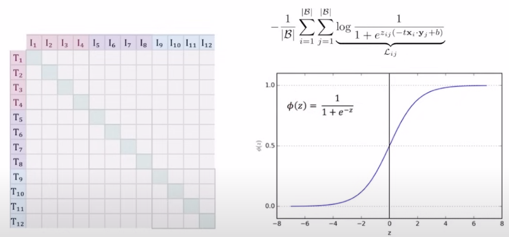
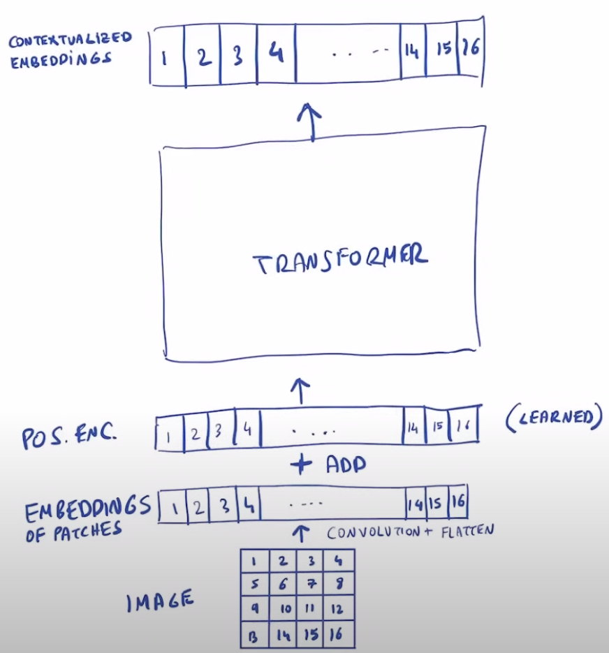
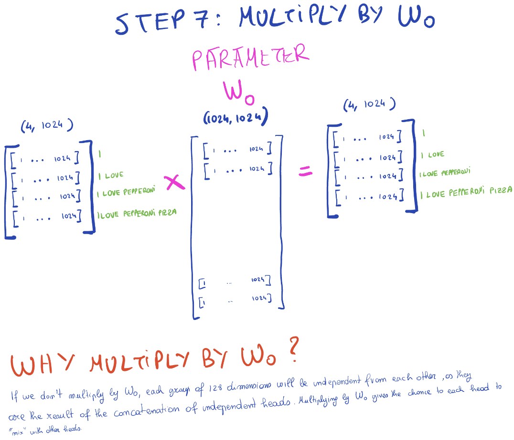

# Table of Contents
- [Table of Contents](#table-of-contents)
- [Components](#components)
  - [1) Contrastive Vision Encoder](#1-contrastive-vision-encoder)
    - [What is contrastive learning?](#what-is-contrastive-learning)
      - [Text Encoder](#text-encoder)
      - [Image Encoder](#image-encoder)
      - [Similarity Matrix](#similarity-matrix)
      - [Training with Loss Functions](#training-with-loss-functions)
      - [CLIP Training Implementation](#clip-training-implementation)
    - [What is the problem with CLIP?](#what-is-the-problem-with-clip)
      - [1. The Softmax Function](#1-the-softmax-function)
        - [In CLIP's Context](#in-clips-context)
        - [The Solution: Log-Space Calculations](#the-solution-log-space-calculations)
      - [2. Computational Challenges in CLIP](#2-computational-challenges-in-clip)
        - [Asymmetric Computation Requirements](#asymmetric-computation-requirements)
        - [Why This Is Expensive](#why-this-is-expensive)
        - [**Solution** to Computational Challenges: Sigmoid Loss](#solution-to-computational-challenges-sigmoid-loss)
          - [Why Replace Cross-Entropy Loss?](#why-replace-cross-entropy-loss)
          - [How Sigmoid Loss Works](#how-sigmoid-loss-works)
        - [SigLIP's Sigmoid-based Solution](#siglips-sigmoid-based-solution)
          - [How SigLIP Works](#how-siglip-works)
        - [Example of SigLIP Processing](#example-of-siglip-processing)
    - [Vision Transformers (general)](#vision-transformers-general)
      - [Actual SigLip Encoder Diagram](#actual-siglip-encoder-diagram)
  - [2) Input Processor \& Linear Projection](#2-input-processor--linear-projection)
    - [Input Processing Overview](#input-processing-overview)
      - [Step 1: Image Processing](#step-1-image-processing)
      - [Step 2: Text Processing](#step-2-text-processing)
      - [Step 3: Creating Combined Input Sequence](#step-3-creating-combined-input-sequence)
      - [Step 4: Linear Projection](#step-4-linear-projection)
    - [Example: Processing a Single Input](#example-processing-a-single-input)
  - [3) Gemma 2B Language Model](#3-gemma-2b-language-model)
    - [Transformer Decoder Architecture and Flow](#transformer-decoder-architecture-and-flow)
      - [From Embeddings to Outputs](#from-embeddings-to-outputs)
      - [Visualization: Data Flow Through the Transformer Architecture](#visualization-data-flow-through-the-transformer-architecture)
      - [Code Implementation](#code-implementation)
    - [RMS Normalization in Gemma](#rms-normalization-in-gemma)
      - [Layer Normalization vs. RMS Normalization](#layer-normalization-vs-rms-normalization)
      - [Why RMS Works: Rescaling vs. Recentering](#why-rms-works-rescaling-vs-recentering)
      - [Benefits of RMS Normalization](#benefits-of-rms-normalization)
    - [KV Cache](#kv-cache)
      - [The Problem: Inefficient Inference in Transformers](#the-problem-inefficient-inference-in-transformers)
        - [How Transformers Work During Training](#how-transformers-work-during-training)
        - [How Transformers Work During Inference](#how-transformers-work-during-inference)
          - [The Inefficiency Problem During Inference](#the-inefficiency-problem-during-inference)
      - [How KV Cache Works](#how-kv-cache-works)
        - [The Key Insight: Reusing Past Computations](#the-key-insight-reusing-past-computations)
        - [The Crucial Observation](#the-crucial-observation)
        - [KV Cache in Action: Step by Step](#kv-cache-in-action-step-by-step)
        - [Why This Is Efficient](#why-this-is-efficient)
        - [Implementation Considerations](#implementation-considerations)
          - [Prefilling: Optimizing for Longer Prompts (Batch Processing)](#prefilling-optimizing-for-longer-prompts-batch-processing)
      - [PaliGemma's Unique Attention Masking Approach](#paligemmas-unique-attention-masking-approach)
        - [Understanding the Attention Mask Matrix](#understanding-the-attention-mask-matrix)
        - [Why This Approach Makes Sense for PaliGemma](#why-this-approach-makes-sense-for-paligemma)
        - [Step-by-Step Attention Flow](#step-by-step-attention-flow)
        - [Advantages for Inference and KV Cache](#advantages-for-inference-and-kv-cache)
- [Random Teachings](#random-teachings)
  - [Normalization](#normalization)
    - [Linear Layer and Layer Normalization Example](#linear-layer-and-layer-normalization-example)
    - [Why Layer Normalization?](#why-layer-normalization)
    - [The Problem of Covariate Shift](#the-problem-of-covariate-shift)
      - [Batch Normalization: A Solution to Covariate Shifts](#batch-normalization-a-solution-to-covariate-shifts)
      - [Layer Normalization: A Better Solution](#layer-normalization-a-better-solution)
      - [Key Difference: Normalization Dimensions](#key-difference-normalization-dimensions)
  - [Multi-Head Attention](#multi-head-attention)
    - [Vision Transformers: Contextualizing Image Patches](#vision-transformers-contextualizing-image-patches)
    - [Language Models: Causal Self-Attention](#language-models-causal-self-attention)
    - [Parallel Training: A Powerful Feature](#parallel-training-a-powerful-feature)
    - [How it Works](#how-it-works)
      - [Step 1: From X to Q, K, V Transformations](#step-1-from-x-to-q-k-v-transformations)
        - [Matrix Multiplication Process](#matrix-multiplication-process)
        - [Visualizing the Transformation](#visualizing-the-transformation)
        - [Importance of Matrix Multiplication for Multi-Head Attention](#importance-of-matrix-multiplication-for-multi-head-attention)
      - [Step 2: Treat Each Head Independently!](#step-2-treat-each-head-independently)
        - [Initial Matrix Structure (Left Side)](#initial-matrix-structure-left-side)
        - [Transposition Process (Arrow in Diagram)](#transposition-process-arrow-in-diagram)
        - [Resulting Structure (Right Side)](#resulting-structure-right-side)
        - [Why This Transformation Matters](#why-this-transformation-matters)
      - [Step 3: Calculate the Attention for Each Head in Parallel](#step-3-calculate-the-attention-for-each-head-in-parallel)
        - [Matrix Setup and Multiplication](#matrix-setup-and-multiplication)
        - [Attention Score Computation](#attention-score-computation)
        - [Scaling Factor (√d\_head)](#scaling-factor-d_head)
        - [Attention Mask for Language Models](#attention-mask-for-language-models)
        - [Softmax Application](#softmax-application)
      - [Step 4: Multiply by the V Sequence](#step-4-multiply-by-the-v-sequence)
        - [Matrix Components](#matrix-components)
        - [Computing Weighted Sums](#computing-weighted-sums)
        - [Understanding the Weighted Combinations](#understanding-the-weighted-combinations)
      - [Step 5, 6, 7: Transpose Back, Concatenate all the Heads and Multiply by Wo](#step-5-6-7-transpose-back-concatenate-all-the-heads-and-multiply-by-wo)
        - [Step 5: Transpose Back](#step-5-transpose-back)
        - [Step 6: Concatenate all the Heads](#step-6-concatenate-all-the-heads)
        - [Step 7: Multiply by Wo](#step-7-multiply-by-wo)
        - [Why This Process Matters](#why-this-process-matters)
  - [Weight Tying](#weight-tying)
    - [What is Weight Tying?](#what-is-weight-tying)
    - [Transformer Architecture and Output Layer](#transformer-architecture-and-output-layer)
    - [The Symmetry Between Input and Output Layers](#the-symmetry-between-input-and-output-layers)
    - [Benefits of Weight Tying](#benefits-of-weight-tying)
    - [What Are Parameters?](#what-are-parameters)
    - [Weight Tying in PaliGemma](#weight-tying-in-paligemma)

# Components


## 1) Contrastive Vision Encoder

### What is contrastive learning?

Above is an example of **CLIP** (Contrastive-Language-Image Pre-training) architecture.

#### Text Encoder
The text encoder in CLIP typically uses a Transformer-based architecture (similar to GPT or BERT):
1. Input Processing
   - Text is first tokenized into sub-words
   - Example: "Pepper the aussie pup" → ["Pepper", "the", "aussie", "pup"]

2. Token Embeddings (e.g. T1, T2, T3 ... Tn)
   - Each token is converted into an embedding vector
   - Positional encodings are added to maintain sequence order

3. Transformer Processing
    ```
    [CLS] (special classification token that aggregates sequence info) + tokens → Transformer Layers →
    ↓
    Self-attention processes relationships between words
    ↓
    Feed-forward networks process token representations
    ↓
    Final text embedding
    ```

<br>

---

#### Image Encoder
The image encoder typically uses a Vision Transformer (ViT) or CNN architecture:
1. Image Preprocessing
    ```
    Original Image (in this case puppy photo) → Resize → Normalize
    ↓
    Split into patches (for ViT) or process through conv layers (for CNN)
    ```

2. For Vision Transformer (ViT)
    ```
    Image patches → Linear projection + position embeddings
    ↓
    Transformer encoder layers process patch relationships
    ↓
    Image embeddings (I₁, I₂, I₃, ..., Iₙ)
    ↓
    Paired with text embeddings to form similarity matrix
    ```

3. For CNN-based
    ```
    Image → Convolutional layers
    ↓
    Feature maps at different scales
    ↓
    Global pooling for final representation
    ```

PaliGemma is **ViT-based** rather than CNN-based.

<br>

---

#### Similarity Matrix
The grid in the center represents how well each image feature matches with each text feature. Essentially
the corresponding text embedding paired with the image embedding's dot product should have a high value (the blue squares). 
(e.g. I1 * T1)

A longer overview: 
1. Matrix Structure
   - Rows: Image features (I₁, I₂, I₃, ..., Iₙ)
   - Columns: Text features (T₁, T₂, T₃, ..., Tₙ)
   - Each cell (Iᵢ·Tⱼ): Similarity score between an image feature and text feature

2. How it Works
   - Higher scores (brighter cells) = stronger matches (e.g. I₁ * T₁)
   - Lower scores (lighter cells) = weaker matches (e.g. I₁ * T₂)
   - During training, the model learns to:
     - Maximize scores for matching image-text pairs
     - Minimize scores for non-matching pairs

3. Training Objective
   - The model wants matching pairs (like a dog photo with "aussie pup" text) to have high similarity
   - Non-matching pairs (like a dog photo with "red car" text) should have low similarity
   - This pushes the model to understand the relationship between visual and textual content

This contrastive approach helps the model learn meaningful connections between images and text without needing explicit labels for every concept.

<br>

---

**Problem:** How do we train the model to maximize similarity scores for matching image-text pairs (brighter cells) while minimizing scores for non-matching pairs (lighter cells)?

**Answer:** We use cross-entropy loss!

<br>

---

#### Training with Loss Functions

To train CLIP effectively, we use **cross-entropy loss**. To understand why this works well, let's first look at how language models are typically trained:

1. **Language Model Training Example**
   - Given a sentence: "I am very into ___"
   - Using Next Token Prediction Task
   - The model produces embeddings → converts to logits (raw scores before softmax)
   
   Example logits output might look like:
   ```python
   # Raw logit scores for possible next words
   logits = {
       "fashion": 5.2,   # Highest score
       "games": 3.1,
       "sports": 2.8,
       "coding": 1.9,
       "music": 1.7
       # ... (thousands more words with scores)
   }
   
   # After softmax conversion to probabilities distribution
   probabilities = {
       "fashion": 0.65,  # 65% confidence
       "games": 0.15,    # 15% confidence
       "sports": 0.12,   # 12% confidence
       "coding": 0.05,   # 5% confidence
       "music": 0.03     # 3% confidence
       # ... (all probabilities sum to 1)
   }
   ```
   
   - Logits are the raw scores before probability conversion
   - Cross-entropy loss helps by:
     - Converting these raw logits into probabilities using softmax
     - Pushing the probability of correct word ("fashion") towards 1
     - Pushing other probabilities towards 0

2. **Applying This to CLIP**
   - Instead of predicting next words like above, we're matching images and text instead
   - Each row/column in our similarity matrix needs one high value (matching pair dot products)
   - All other values should be low (non-matching pairs)

   Let's look at a small example with 3 images and 3 text pairs:

   **Step 1: Raw Similarity Scores**
   - When I₁ (dog photo) is compared with:
     - T₁ (text "aussie pup"): score 0.9 ✓
     - T₂ (text "red car"): score 0.3 ✗
     - T₃ (text "blue sky"): score 0.2 ✗

   - When I₂ (car photo) is compared with:
     - T₁ (text "aussie pup"): score 0.2 ✗
     - T₂ (text "red car"): score 0.8 ✓
     - T₃ (text "blue sky"): score 0.3 ✗

   - When I₃ (sky photo) is compared with:
     - T₁ (text "aussie pup"): score 0.1 ✗
     - T₂ (text "red car"): score 0.2 ✗
     - T₃ (text "blue sky"): score 0.95 ✓

   **Step 2: After Softmax (Image → Text Direction)**
   - For I₁ (dog photo):
     - T₁: 65% probability ✓ (want this to be 100%)
     - T₂: 20% probability ✗ (want this to be 0%)
     - T₃: 15% probability ✗ (want this to be 0%)

   **Step 3: After Softmax (Text → Image Direction)**
   - For T₁ (text "aussie pup"):
     - I₁: 70% probability ✓ (want this to be 100%)
     - I₂: 20% probability ✗ (want this to be 0%)
     - I₃: 10% probability ✗ (want this to be 0%)

   Cross-entropy loss then:
   - Makes correct pairs (marked with ✓) have higher probability
   - Makes incorrect pairs (marked with ✗) have lower probability
   - Does this in both directions (image→text and text→image)
   - Combines both directions for balanced training

The actual code implementation of this process is shown in the "CLIP Training Implementation" section below.

<br>

---

#### CLIP Training Implementation

Here's an example of how the contrastive learning is implemented based on the CLIP diagram above:

```python
# Based on official CLIP paper implementation
def clip_training(image_encoder, text_encoder, images, texts, temperature=0.07):
    # Step 1: Encode images and text through their respective encoders (purple and green sections in diagram)
    image_features = image_encoder(images)  # [batch_size, feature_dim] -> Creates I₁, I₂, I₃, ..., Iₙ
    text_features = text_encoder(texts)     # [batch_size, feature_dim] -> Creates T₁, T₂, T₃, ..., Tₙ
    
    # Step 2: Normalize features to unit length (helps with dot product similarity)
    # This ensures all similarity scores are between -1 and 1
    image_features = image_features / image_features.norm(dim=1, keepdim=True)
    text_features = text_features / text_features.norm(dim=1, keepdim=True)
    
    # Step 3: Create the similarity matrix shown in the center of the diagram
    # image_features @ text_features.t() computes all possible I·T dot products
    # This creates the grid where each cell is Iᵢ·Tⱼ
    logits = (image_features @ text_features.t()) / temperature
    
    # Step 4: Set up the ground truth - we want the diagonal to be highest
    # In the diagram, this means:
    # - The blue squares should have high values (matching pairs)
    # - All other squares should have low values
    labels = torch.arange(len(images))
    
    # Step 5: Compute bidirectional loss
    # For each row (image): want I₁·T₁ to be highest in row 1, I₂·T₂ in row 2, etc.
    image_loss = cross_entropy_loss(logits, labels)
    # For each column (text): want I₁·T₁ to be highest in column 1, I₂·T₂ in column 2, etc.
    text_loss = cross_entropy_loss(logits.t(), labels)
    
    # Step 6: Combine losses symmetrically
    # This ensures both modalities are trained equally
    loss = (image_loss + text_loss) / 2
    
    return loss

# The training process aims to:
# 1. Maximize values in the blue squares (like I₁·T₁, I₂·T₂, etc.)
#    - These are the matching pairs shown in the diagram
# 2. Minimize values everywhere else
#    - The non-blue squares represent incorrect pairings
# 
# Temperature controls contrast in similarity scores:
# - Control how "strict" the model is in its matching
# - Lower temperature (e.g., 0.07) = sharper contrast between matches/non-matches
# - Higher temperature = softer, more gradual distinctions
```

This implementation:
1. Processes batches of image-text pairs
2. Creates normalized embeddings in the same space
3. Computes similarity scores between all possible pairs
4. Uses cross-entropy loss to push matching pairs together
5. While pushing non-matching pairs apart in the embedding space

<br>

---

<br>

### What is the problem with CLIP?

Using cross-entropy loss is a problem with CLIP due to numerical stability issues with the softmax function. Let's break this down:

<br>

#### 1. The Softmax Function

The softmax function converts raw logits into a probability distribution. For input vector x:

$$ \text{softmax}(x_i) = \frac{e^{x_i}}{\sum_{j=1}^n e^{x_j}} $$

Where:
- $x_i$ is the current logit (similarity score)
- $e^x$ is the exponential function (e ≈ 2.71828)
- $\sum_{j=1}^n e^{x_j}$ is the sum of all exponentials in the sequence

<br>

**Problem: Exponential Growth**
- When x is large, exp(x) grows extremely fast
- For example:
  - exp(10) ≈ 22,026
  - exp(50) ≈ 5.18 × 10²¹
  - exp(100) ≈ 2.69 × 10⁴³
- A 32-bit float can only represent numbers up to ~3.4 × 10³⁸
- This means exp(89) is already too large to represent!

<br>

---

##### In CLIP's Context

When computing similarity scores:
1. Large dot products between embeddings can produce large numbers
2. These large numbers get exponentially larger through softmax
3. This can lead to:
   - Numerical overflow (numbers too large to represent)
   - Loss of precision
   - NaN (Not a Number) errors

<br>

---

##### The Solution: Log-Space Calculations

Looking at the similarity matrix in the image, we need to compute stable similarity scores between image features (I₁, I₂, I₃, ..., Iₙ) and text features (T₁, T₂, T₃, ..., Tₙ). To prevent numerical instability:

$$ \text{log\_softmax}(x_i) = x_i - \log(\sum_{j=1}^n e^{x_j}) $$

This first equation:
- Takes the original similarity score ($x_i$)
- Subtracts the log of the sum of exponentials
- Helps avoid overflow by working in log space

We can make this even more stable by rewriting it as:

$$ \text{log\_softmax}(x_i) = x_i - (\max(x) + \log(\sum_{j=1}^n e^{x_j - \max(x)})) $$

This improved version:
- First finds the maximum value in the sequence ($\max(x)$)
- Subtracts this maximum from each score before exponentiating
- Makes all values ≤ 0 before exp(), preventing overflow
- Adds back the maximum at the end to maintain correctness

For example, in our similarity matrix:
- If I₂·T₂ = 100 (maximum score in column T₂)
- Then we subtract 100 from all scores in that column
- Now exp(score - 100) will be small and manageable
- The relative relationships between scores are preserved

This stabilization is crucial because:
1. Each row in the matrix needs one high value (matching pair)
2. Each column needs one high value (matching pair)
3. All other values should be relatively small
4. We need to compute this stably for both image→text and text→image directions

<br>

#### 2. Computational Challenges in CLIP

Looking at the similarity matrix in the image, CLIP faces significant computational overhead due to its bidirectional nature:

##### Asymmetric Computation Requirements

Based on the SigLip paper, due to the asymmetry of the softmax loss, normalization is performed twice: across images and across texts:

1. **Row-wise Softmax (Image → Text)**
   - For each image embedding (I₁, I₂, ..., Iₙ):
     - Must compute softmax across all text embeddings
     - Example: For I₃ row, compute softmax over [I₃·T₁, I₃·T₂, I₃·T₃, ..., I₃·Tₙ]
   - Total: N softmax computations (one per row)

2. **Column-wise Softmax (Text → Image)**
   - For each text embedding (T₁, T₂, ..., Tₙ):
     - Must compute softmax across all image embeddings
     - Example: For T₂ column (purple dotted box), compute softmax over [I₁·T₂, I₂·T₂, I₃·T₂, ..., Iₙ·T₂]
   - Total: N softmax computations (one per column)

<br>

---

##### Why This Is Expensive

1. **Scaling Issues**
   - With batch size N, need 2N softmax computations
   - Each softmax requires:
     - N exponential operations
     - N additions for the denominator
     - N divisions for normalization

2. **Memory Requirements**
   - Must store full N×N similarity matrix
   - Keeps all intermediate values for gradient computation
   - Memory grows quadratically with batch size

3. **Computational Complexity**
   - Total operations: O(N²) for matrix creation
   - Plus O(N²) for bidirectional softmax
   - Makes large batch training challenging

<br>

---

##### **Solution** to Computational Challenges: Sigmoid Loss



One solution to CLIP's computational overhead is replacing cross-entropy loss with sigmoid loss:

###### Why Replace Cross-Entropy Loss?

1. **Problem with Cross-Entropy**
   - Requires softmax computation first
   - As we saw, needs both row-wise and column-wise softmax
   - Computationally expensive at O(N²)
   - Memory intensive for large batches

2. **Sigmoid Loss Alternative**
   - Operates on individual similarity scores
   - No need for softmax normalization
   - Can process each I·T pair independently
   - Reduces memory and computation requirements

###### How Sigmoid Loss Works

Instead of normalizing across rows and columns:
1. Each similarity score I·T is passed through sigmoid function:
   $$ \sigma(x) = \frac{1}{1 + e^{-x}} $$

2. Binary cross-entropy is applied to each score:
   - Matching pairs (diagonal) should output 1
   - Non-matching pairs should output 0

Benefits:
- Processes each element independently
- No need for expensive normalization
- Memory efficient: can process in smaller chunks
- Still maintains contrastive learning objective

Comparison of Complexity:
```
Cross-Entropy + Softmax:
- Must process entire N×N matrix at once
- O(N²) memory and computation

Sigmoid Loss:
- Can process elements independently
- O(1) per element
- Easily parallelizable
```

This approach trades off some model accuracy for significant computational efficiency, making it more practical for large-scale training. Below is a larger overview of how sigmoid loss works.

<br>

---

##### SigLIP's Sigmoid-based Solution

Looking at the similarity matrix in the image, SigLIP (Sigmoid Loss for Image-Text Pairs) proposes a more efficient approach:

###### How SigLIP Works

1. **Direct Similarity Processing**
   - For each cell in the similarity matrix (I·T pairs):
     - I₁·T₁, I₁·T₂, I₁·T₃, ... (first row)
     - I₂·T₁, I₂·T₂, I₂·T₃, ... (second row)
     - And so on...
   - Each similarity score is processed independently through sigmoid

2. **Binary Labels**
   - Matching pairs (blue squares in diagram):
     - I₁·T₁ should be 1
     - I₂·T₂ should be 1
     - I₃·T₃ should be 1
   - Non-matching pairs (all other cells):
     - Should be 0
     - Example: I₁·T₂, I₁·T₃, I₂·T₁, etc.

3. **Loss Computation**
   $$ L_{SigLIP} = -\frac{1}{N}\sum_{i=1}^N [\log(\sigma(s_{ii})) + \sum_{j\neq i}\log(1-\sigma(s_{ij}))] $$
   
   Where:
   - $s_{ij}$ is the similarity score between Iᵢ and Tⱼ
   - $\sigma$ is the sigmoid function
   - $s_{ii}$ represents matching pairs (diagonal)
   - $s_{ij}$ (i≠j) represents non-matching pairs

4. **Key Benefits**
   - No need for row/column normalization
   - Can process each cell independently
   - Easily parallelizable
   - Memory efficient: can process subsets of matrix

5. **Comparison to Original CLIP**
   - Original CLIP (looking at T₂ column in purple):
     - Needs entire column to compute softmax
     - Must normalize across all image pairs
   - SigLIP:
     - Can process I₁·T₂, I₂·T₂, I₃·T₂ independently
     - No need to wait for full column computation

This approach maintains the contrastive learning objective (matching correct image-text pairs) while being computationally more efficient and numerically stable.

<br>

---

##### Example of SigLIP Processing

Let's look at a small 3×3 example from our similarity matrix:

1. **Raw Similarity Scores**
   ```
   Similarity Matrix (s_ij):
   [Dog Image I₁]    [0.8  0.2  0.1]  → [T₁: "aussie pup"]
   [Car Image I₂]    [0.1  0.9  0.2]  → [T₂: "red car"]
   [Sky Image I₃]    [0.2  0.1  0.7]  → [T₃: "blue sky"]
   ```

2. **Apply Sigmoid to Each Score**
   $$ \sigma(x) = \frac{1}{1 + e^{-x}} $$
   
   ```
   After Sigmoid:
   [Dog Image I₁]    [0.69  0.45  0.42]  → [T₁: "aussie pup"]
   [Car Image I₂]    [0.42  0.71  0.45]  → [T₂: "red car"]
   [Sky Image I₃]    [0.45  0.42  0.67]  → [T₃: "blue sky"]
   ```

3. **Binary Label Classification**
   ```
   Target Matrix (1 for matches, 0 for non-matches):
   [Dog Image I₁]    [1  0  0]  → [T₁: "aussie pup"]
   [Car Image I₂]    [0  1  0]  → [T₂: "red car"]
   [Sky Image I₃]    [0  0  1]  → [T₃: "blue sky"]
   ```

4. **Loss Computation**
   For diagonal elements (matches):
   - I₁·T₁: -log(0.69)
   - I₂·T₂: -log(0.71)
   - I₃·T₃: -log(0.67)

   For off-diagonal elements (non-matches):
   - I₁·T₂: -log(1 - 0.45)
   - I₁·T₃: -log(1 - 0.42)
   etc.

   Final loss is the average of all these terms.

Key Advantages Shown in Example:
1. Each cell processed independently
2. No need to normalize rows or columns
3. Can compute loss for any subset of pairs
4. Numerically stable (all values between 0 and 1)

<br>

---

<br>

### Vision Transformers (general)

Using the article "An Image is Worth 16x16 Words: Transformers for Image Recognition at Scale" (https://arxiv.org/abs/2010.11929), we will dive deep on how it works for the 
Contrastive Vision Encoder. The transformer model is a sequence-to-sequence model that is fed with a sequence of embeddings that outputs a sequence of contextualized embeddings.

**NOTE:** See "Actual SigLip Encoder Diagram" below to see the actual diagram for the encoder that contains the connections.


What the transformer looks like: <br>


Looking at the vision transformer diagram, we can see the process flows from bottom to top:
1. Start with an input IMAGE (4x4 grid shown in diagram)
2. Transform it into EMBEDDINGS OF PATCHES
3. Add positional encodings (POS. ENC.)
4. Process through TRANSFORMER
5. Output CONTEXTUALIZED EMBEDDINGS

Let's dive deeper into each step:

1. **Image Patching & Convolution**
   - Starting with the IMAGE in the diagram (4x4 grid at bottom)
   - The image is divided into non-overlapping patches
   - In the diagram, we see a 4x4 grid creating 16 patches (numbered 1-16)
   ```python
   # Example of patch extraction using convolution
   class PatchExtractor(nn.Module):
       def __init__(self, patch_size):
           super().__init__()
           self.conv = nn.Conv2d(
               in_channels=3,  # RGB image
               out_channels=768,  # Embedding dimension
               kernel_size=patch_size,
               stride=patch_size
           )
           
       def forward(self, x):  # x: (B, 3, H, W)
           # Convert image to patches using convolution
           patches = self.conv(x)  # (B, 768, H/patch_size, W/patch_size)
           # Reshape to sequence of patches
           patches = patches.flatten(2).transpose(1, 2)  # (B, N, 768)
           return patches
   ```

2. **Embedding Creation (EMBEDDINGS OF PATCHES in diagram)**
   - Each patch is processed through convolution + flatten operation
   - This flattens each 2D patch (e.g. 16x16 pixels with 3 RGB channels = 768 values) into a single row vector by concatenating all pixel values in sequence
   - Results in sequence of embeddings (shown as 1-16 in bottom row)
   ```python
   # Converting patches to embeddings
   patch_dim = patch_size * patch_size * 3  # 16x16x3 = 768 for 16x16 patches
   embedding_dim = 768
   patch_to_embedding = nn.Linear(patch_dim, embedding_dim)
   ```

3. **Position Encoding Addition (POS. ENC. in diagram)**
   - The diagram shows "POS. ENC." row with numbers 1-16
   - Position encodings are vectors that encode the spatial location of each patch
   - When added to patch embeddings, they help the transformer understand where each patch was located in the original image
   - Without position encodings, the transformer would lose all spatial information since patches are processed as a flat sequence
   - The addition is element-wise: each position encoding vector is added to its corresponding patch embedding vector
   ```python
   class PositionalEncoding(nn.Module):
       def __init__(self, d_model, max_patches):
           super().__init__()
           # Create learnable position embeddings
           self.pos_embedding = nn.Parameter(
               torch.randn(1, max_patches, d_model)
           )
           
       def forward(self, x):
           # x: patch embeddings (B, N, D)
           return x + self.pos_embedding  # Add positional information
   ```

4. **Transformer Processing**
   - The large "TRANSFORMER" box in diagram processes the sequence
   - Each patch embedding can interact with and incorporate information from all other patch embeddings through self-attention:
     - For example, if patch 1 shows part of a dog's ear and patch 8 shows part of the tail:
       - The self-attention mechanism allows patch 1 to look at patch 8 and all other patches
       - This helps patch 1's embedding understand it's part of a larger dog shape
       - Similarly, patch 8 can look back at patch 1 and other patches
     - This all-to-all interaction between patches is what the large "TRANSFORMER" box represents
   - Uses standard transformer encoder architecture with modifications:
   ```python
   class TransformerEncoder(nn.Module):
       def __init__(self, dim, depth, heads):
           super().__init__()
           self.layers = nn.ModuleList([])
           for _ in range(depth):
               self.layers.append(nn.ModuleList([
                   PreNorm(dim, SelfAttention(dim, heads)),
                   PreNorm(dim, FeedForward(dim))
               ]))
           
       def forward(self, x):
           # x: sequence of patch embeddings + positions
           for attn, ff in self.layers:
               # Self-attention allows patches to interact
               x = attn(x) + x  # Residual connection
               x = ff(x) + x    # MLP processing
           return x
   ```

5. **Final Contextualized Embeddings**
   - Output shown at top of diagram as "CONTEXTUALIZED EMBEDDINGS"
   - Each position (1-16) now contains information from other patches
   - The embeddings maintain spatial relationships but are enriched with context
   - These embeddings can be used for downstream tasks
   - Unlike language models that process tokens sequentially (word1 → word2 → word3),
     Vision Transformers process all patches simultaneously:
     ```
     Language Model (Sequential):
     "The" → "cat" → "sits" → "on" → "mat"
     (Each word depends on previous words)
     
     Vision Transformer (Parallel):
     Patch1 ↔ Patch2 ↔ Patch3 ↔ ... ↔ Patch16
     (All patches attend to each other simultaneously)
     ```
   - Example with a light source in an image:
     - Consider patches showing a lamp illuminating a room
     - In the diagram's 4x4 grid, if patch 6 contains a bright lamp:
       1. Initial patch embedding just sees local brightness
       2. Through transformer's self-attention (big "TRANSFORMER" box):
          - Patch 6 (lamp) influences all other patches
          - Surrounding patches (5,7,2,10) learn light falloff
          - Distant patches learn shadow patterns
       3. Final contextualized embeddings (top row) capture:
          - Local features (brightness, color)
          - Global context (lighting effects, shadows)
          - Spatial relationships (light direction, distance)
   - This parallel processing of all patches enables the model to:
     - Capture complex spatial relationships
     - Model long-range dependencies across the image
     - Learn global visual patterns

The diagram effectively shows the transformation from:
- 2D spatial image (bottom 4x4 grid)
- To 1D sequence of patch embeddings (EMBEDDINGS OF PATCHES)
- Enhanced with position information (POS. ENC.)
- Processed through transformer for context (TRANSFORMER)
- Resulting in final contextualized representation (top row)

This process allows the model to:
1. Break down spatial image data into processable sequences
2. Maintain spatial relationships through position encodings
3. Enable global reasoning through transformer's self-attention
4. Create rich, context-aware representations of image patches

<br>

---

#### Actual SigLip Encoder Diagram


The SigLIP encoder diagram shows the detailed architecture of the vision encoder component. Let's break down its key components and their roles:

1. **Input: Patch Embeddings with Positional Encodings**
   - Bottom of diagram shows input embeddings
   - Each embedding represents a patch of the image
   - Position encodings are added to maintain spatial information

2. **Layer Architecture (repeated Nx times)**
   Each encoder layer contains:
   
   a) **First Branch**
   - Layer Normalization (yellow box)
   - Self-Attention mechanism
   - Residual connection (+)
   
   b) **Second Branch**
   - Layer Normalization (yellow box)
   - MLP (Multi-Layer Perceptron)
   - Residual connection (+)

3. **Layer Normalization**
   - Shown as yellow boxes in the diagram
   - Applied before attention and MLP (pre-norm design)
   - Helps stabilize training by normalizing activations
   - Prevents internal covariate shift

4. **Self-Attention**
   - Allows each patch to attend to all other patches
   - Computes attention scores between patches
   - Helps build global understanding of image
   - Key component for capturing long-range dependencies

5. **MLP (Multi-Layer Perceptron)**
   - Two-layer feed-forward network
   - Projects to higher dimension then back
   - Adds non-linearity through GELU activation
   - Increases model capacity

   **GELU Activation's Importance:**
     - **Non-linearity Introduction**
       - Without GELU, MLP would just be composed linear transformations
       - GELU enables learning of complex, non-linear patterns
       - Critical for modeling sophisticated visual relationships

     - **Modern Transformer Choice**
       - Standard activation in modern transformer architectures
       - Performs better than traditional ReLU or tanh
       - Combines benefits of ReLU with smoother gradient properties

     - **Mathematical Properties**
       - Defined as: GELU(x) = x * Φ(x)
       - Where Φ(x) is the cumulative distribution function of standard normal
       - Provides smooth activation with good gradient characteristics
       - Can be efficiently approximated using tanh-based implementation

     - **Processing Pipeline**
       ```
       Input Features → Linear Expansion → GELU → Linear Projection
       [dim] → [4*dim] → [4*dim] → [dim]
       ```
       - First expands feature space for richer representations
       - Applies non-linear transformation via GELU
       - Projects back to required dimension
       - Maintains dimensionality compatibility with residual connections

     - **Training Benefits**
       - Smooth gradient flow for stable training
       - Probabilistic interpretation helps with regularization
       - Better training dynamics in deep transformer architectures
       - Efficient computation with tanh approximation

6. **Residual Connections**
   - Shown as "+" in the diagram
   - Skip connections that add input to output
   - Help with gradient flow during training
   - Allow model to preserve low-level features

7. **Design Philosophy**
   - Pre-norm architecture (LayerNorm before attention/MLP)
   - Dual processing streams (attention and MLP)
   - Deep network with repeated layers
   - Heavy use of residual connections

The key innovation in SigLIP is not in this encoder structure (which follows standard transformer design), but rather in how the embeddings it produces are used in the contrastive learning setup with sigmoid loss.

<br>

## 2) Input Processor & Linear Projection


In the middle of the diagram above, you can see that we need to find a way to combine the image token and the text tokens before being processed by the Gemma 2B Language Model Transformer. This section explains how PaliGemma processes and combines image and text inputs to create a unified representation for the language model.

To summarize, the components from the diagram for this section consists of:
1. Input image (from SigLIP vision model section)
2. Input prompt: "Where is the photographer resting"
3. Tokenizer
4. Linear Projection (from SigLIP vision model section)
5. The middle of the diagram where it combines the image and text tokens (unified representation for language model)

### Input Processing Overview

PaliGemma, like other vision-language models, needs to process two different modalities:
1. **Images**: Processed through the Contrastive Vision Encoder (SigLIP)
2. **Text**: Processed through tokenization

The challenge is to combine these different modalities in a way that allows the language model to understand both simultaneously. Let's explore how this works:

---

#### Step 1: Image Processing

Looking at the top-left of the architecture diagram, we start with:
1. An input image is loaded as a tensor with shape [B, C, H, W] where:
   - B: Batch size
   - C: Channels (3 for RGB)
   - H: Height
   - W: Width

2. The image is processed through several steps:
   ```python
   def process_images(images, size, resample, rescale_factor, image_mean, image_std):
       # Resize images to the required dimensions
       # Convert to numpy arrays
       # Rescale pixel values to [0, 1]
       # Normalize using mean and standard deviation
       # Transpose to [C, H, W] format expected by the model
   ```

3. The Contrastive Vision Encoder (SigLIP) extracts visual features from the image

---

#### Step 2: Text Processing

Looking at the bottom-left of the architecture diagram:
1. The text prompt (e.g., "Where is the photographer resting?") is passed to a tokenizer
2. The tokenizer converts the text into token IDs based on its vocabulary
3. These token IDs represent the text in a numerical format that the model can process

---

#### Step 3: Creating Combined Input Sequence


The key innovation is how these two modalities are combined:

1. **Image Token Placeholders**:
   - PaliGemma uses a special `<image>` token as a placeholder
   - These placeholders will later be replaced with actual image embeddings

2. **Input Sequence Construction**:
   ```python
   def add_image_tokens_to_prompt(prefix_prompt, bos_token, image_seq_len, image_token):
       return f"{image_token * image_seq_len}{bos_token}{prefix_prompt}\n"
   ```
   Above is from processing.py.

   This creates a sequence with:
   - A series of image tokens (`<image>` repeated `image_seq_len` times)
   - The beginning-of-sequence (BOS) token
   - The text prompt
   - A newline character as a separator

3. **Token Structure**:
   As shown in the input-paligemma.png diagram above, the input sequence has:
   - **Image Tokens**: `img1`, `img2`, `img3`, etc. (placeholders for image features)
   - **Prefix Prompt**: Starting with `[bos]` token, followed by input tokens (`inp1`, `inp2`, etc.)
   - **Separator**: The `[sep]` token (represented by the newline character `\n`)
   - **Output Tokens**: The model will generate these (`out1`, `out2`, etc.)

---

#### Step 4: Linear Projection

The linear projection component (shown in the middle of the architecture diagram) is crucial:

1. **Purpose**:
   - Transforms the visual features from the Contrastive Vision Encoder
   - Maps them to the same embedding space as the text tokens
   - Ensures compatibility between image and text representations

2. **Process**:
   - The image features from SigLIP are projected using a linear layer
   - This projection aligns the dimensionality and semantic space of image features with text embeddings
   - The projected features replace the `<image>` placeholder tokens

<br>

---

### Example: Processing a Single Input

Let's walk through a concrete example of how an input is processed:

1. **Starting Point**:
   - Image: A beach scene
   - Text prompt: "Where is the photographer resting?"

2. **Image Processing**:
   - Image is resized to the required dimensions (e.g., 224×224)
   - Pixel values are normalized
   - SigLIP encoder extracts 256 feature vectors

3. **Text Processing**:
   - Text is tokenized: `["Where", "is", "the", "photographer", "resting", "?"]`
   - Converted to token IDs: `[1045, 2003, 1996, 19081, 8690, 1029]`

4. **Combined Input Creation**:
   ```
   # Conceptual representation
   [<image>, <image>, ..., <image>][BOS]Where is the photographer resting?\n
   ```

5. **Token ID Representation**:
   ```
   # Assuming <image> token ID is 50000 and BOS token ID is 1
   [50000, 50000, ..., 50000, 1, 1045, 2003, 1996, 19081, 8690, 1029, 10]
   ```

6. **Linear Projection and Replacement**:
   - SigLIP features are projected to text embedding space
   - The `<image>` tokens are replaced with these projected features
   - The resulting sequence contains both image and text information in a unified format

7. **Final Processing**:
   - The combined sequence is processed by the Gemma 2B Language Model
   - The model can now "see" the image through the projected features
   - It can answer questions about the image by generating appropriate text tokens

This unified representation allows the language model to reason about both the image content and the text prompt, enabling it to generate contextually relevant responses that take both modalities into account.

<br>

## 3) Gemma 2B Language Model

### Transformer Decoder Architecture and Flow


The image above shows the output portion of a decoder-only transformer architecture. It is explained further below on how it is modified in the Gemma 2B language model.

The Gemma 2B language model functions as the decoder component of PaliGemma, processing the combined embeddings from both image and text tokens. Let's examine how data flows through this architecture and how it's implemented in the code.

---

#### From Embeddings to Outputs

After merging image features with text token embeddings (from the `_merge_input_ids_with_image_features` method in `PaliGemmaForConditonalGeneration` within `modeling_gemma.py`), the combined embeddings flow through the transformer decoder architecture:

1. **Input Processing**
   - The combined embeddings enter the decoder without explicit positional encodings
   - Instead, Rotary Positional Encodings (RoPE) are applied within the attention mechanism
   - This is handled by the position_ids parameter which is passed to each decoder layer

2. **Transformer Layer Stack**
   - The embeddings pass through multiple identical transformer decoder layers (`GemmaDecoderLayer`)
   - Each layer consists of:
     - **RMS Normalization** - A variant of layer normalization that uses root mean square
     - **Self-Attention** - Multi-head attention with rotary positional encodings
     - **Skip Connection** - Adds the original input to the attention output
     - **RMS Normalization** - Another normalization before feed-forward
     - **Feed-Forward Network** - Typically expands dimensions, applies non-linearity, then projects back
     - **Skip Connection** - Adds the normalized input to the feed-forward output

3. **Final Processing**
   - After passing through all transformer layers, the output goes through:
     - **Final RMS Normalization** (`self.norm` in `GemmaModel`)
     - **Linear Layer** (`self.lm_head` in `GemmaForCausalLM`) - Projects to vocabulary dimensions
     - **Softmax** (applied during inference) - Converts logits to probability distribution

---

#### Visualization: Data Flow Through the Transformer Architecture

```
                        ┌───────────────────────────────────────────────┐
                        │        Merged Image & Text Embeddings         │
                        └───────────────────────────────────────────────┘
                                              │
                                              ▼
┌─────────────────────────────────────────────────────────────────────────────────────┐
│                                    GemmaModel                                       │
│  ┌─────────────────────────────────────────────────────────────────────────────┐    │
│  │                              GemmaDecoderLayer × N                          │    │
│  │  ┌──────────────────┐     ┌─────────────────┐     ┌────────────────────┐    │    │
│  │  │  RMS Norm        │     │  Self-Attention │     │      Skip          │    │    │
│  │  │  (Pre-Attention) │ ──► │  with RoPE      │ ──► │   Connection +     │    │    │
│  │  └──────────────────┘     └─────────────────┘     └────────────────────┘    │    │
│  │                                                              │              │    │
│  │                                                              ▼              │    │
│  │  ┌──────────────────┐     ┌─────────────────┐     ┌────────────────────┐    │    │
│  │  │   RMS Norm       │     │  Feed Forward   │     │      Skip          │    │    │
│  │  │   (Pre-FFN)      │ ──► │  Network        │ ──► │   Connection +     │    │    │
│  │  └──────────────────┘     └─────────────────┘     └────────────────────┘    │    │
│  └─────────────────────────────────────────────────────────────────────────────┘    │
│                                          │                                          │
│                                          ▼                                          │
│                              ┌──────────────────────┐                               │
│                              │    Final RMS Norm    │                               │
│                              └──────────────────────┘                               │
└─────────────────────────────────────────────────────────────────────────────────────┘
                                          │
                                          ▼ 
┌─────────────────────────────────────────────────────────────────────────────────────┐
│                                GemmaForCausalLM                                     │
│                              ┌──────────────────────┐                               │
│                              │ Linear Layer(lm_head)│                               │
│                              └──────────────────────┘                               │
└─────────────────────────────────────────────────────────────────────────────────────┘
                                          │
                                          ▼
                              ┌──────────────────────┐
                              │       Softmax        │
                              └──────────────────────┘
                                          │
                                          ▼
                              ┌──────────────────────┐
                              │ Output Probabilities │
                              └──────────────────────┘
```

---

#### Code Implementation

The architecture is implemented in `modeling_gemma.py` through several key classes:

1. `GemmaModel`: The core transformer model
   - Contains embedding layer, multiple transformer decoder layers, and final normalization
   - Processes token embeddings through the entire stack

2. `GemmaDecoderLayer`: Individual transformer layers (not shown in the provided code snippet)
   - Implements attention + normalization + feed-forward + skip connections
   - Applies rotary positional encodings within attention mechanism

3. `GemmaForCausalLM`: Extends GemmaModel with output projection
   - Adds the linear layer that converts hidden states to vocabulary-sized logits
   - Returns logits that can be used for next token prediction

4. `GemmaRMSNorm`: Root Mean Square Normalization (not shown in the provided code snippet)
   - Variant of layer normalization used throughout the model
   - Helps stabilize training and improves performance

This architecture follows the standard transformer decoder pattern but uses specific optimizations like RMS normalization and rotary positional encodings that make Gemma particularly effective for language modeling tasks.

<br>

---

### RMS Normalization in Gemma


Gemma uses Root Mean Square (RMS) normalization instead of the standard layer normalization. Let's understand why this optimization matters and how it works.

---

#### Layer Normalization vs. RMS Normalization

**Traditional Layer Normalization:**

In standard layer normalization, which is common in many transformer architectures, we normalize each feature vector by both recentering (shifting to zero mean) and rescaling (to unit variance):

1. For each item (e.g., "cat", "dog", "zebra" in the diagram above), we compute:
   - The mean (μ) across all features in the vector
   - The standard deviation (σ) across all features

2. We then apply the normalization formula:

   $$\text{LayerNorm}(x) = \gamma \cdot \frac{x - \mu}{\sqrt{\sigma^2 + \epsilon}} + \beta$$

   Where:
   - x is the input vector
   - μ is the mean of the features
   - σ is the standard deviation
   - γ and β are learnable parameters
   - ε is a small constant for numerical stability

3. This transforms the distribution of features to have mean 0 and variance 1 (a Gaussian distribution centered at 0)

<br>

**Root Mean Square Normalization:**

RMS normalization simplifies this process by eliminating the recentering step, based on the insight that the rescaling invariance is what truly matters for reducing covariate shift in deep networks.

1. For each input vector, we compute a single statistic - the root mean square:

   $$\text{RMS}(x) = \sqrt{\frac{1}{n} \sum_{i=1}^{n} x_i^2}$$

   Where:
   - x is the input vector
   - n is the number of elements in the vector

2. We then apply the normalization formula:

   $$\text{RMSNorm}(x) = \gamma \cdot \frac{x}{\text{RMS}(x) + \epsilon}$$

   Where:
   - γ is a learnable parameter (weight)
   - ε is a small constant for numerical stability

<br>

---

#### Why RMS Works: Rescaling vs. Recentering

The key insight behind RMS normalization comes from analyzing what makes layer normalization effective:

1. **Rescaling Invariance is What Matters:**
   - Research suggests that the success of layer normalization isn't primarily due to its recentering (shifting to zero mean)
   - Rather, the crucial factor is rescaling (normalizing the magnitude of activations)
   - This keeps features from exploding or vanishing during training

2. **Mean Independence:**
   - Looking at the examples in the diagram, the actual mean of the feature values doesn't need to be zero
   - What matters is that the values cluster around *some* consistent mean (whether that's 0, 500, or -100)
   - The important part is reducing the variance to stabilize training

3. **Variance Reduction:**
   - For the "cat" features shown in the first row, they don't need to be centered at 0
   - They can be centered at any value, as long as their spread (variance) is controlled
   - This is exactly what RMS normalization achieves - controlling the magnitude without shifting the mean

<br>

---

#### Benefits of RMS Normalization

1. **Computational Efficiency:**
   - Computes only one statistic (RMS) instead of two (mean and standard deviation)
   - Eliminates the need to calculate and subtract the mean
   - This results in fewer operations and potentially faster training/inference

2. **Memory Efficiency:**
   - Fewer intermediate values to store during computation
   - Particularly beneficial for large language models with billions of parameters

3. **Empirical Performance:**
   - In practice, models using RMS normalization often train at least as well as those with layer normalization
   - Gemma specifically uses RMS normalization throughout its architecture
   - The GemmaRMSNorm class in the code implements this functionality

4. **Implementation:**
   - In the Gemma implementation, RMS normalization is applied:
     - Before each attention module
     - Before each feed-forward network
     - As the final normalization before the output projection

<br><br>

---

### KV Cache

The KV Cache is a crucial optimization technique for transformer models during inference. Before diving into how it works, let's understand the problems it solves by examining how transformers operate during training versus inference.

#### The Problem: Inefficient Inference in Transformers


##### How Transformers Work During Training

Transformers are fundamentally sequence-to-sequence models. During training:

1. **Parallel Processing**: We feed the model N tokens as input and receive N contextualized token embeddings as output.

2. **Contextualized Embeddings**: As shown in the diagram above, when we train on a sentence like "I love pepperoni pizza":
   - Each input token is converted to an embedding
   - The transformer processes all tokens simultaneously
   - The output consists of contextualized embeddings for each position

3. **Context Capturing**: The nature of the context captured depends on the attention mask used:
   - With a **causal mask** (used in decoder-only models like Gemma): Each token can only attend to itself and previous tokens
     - In the diagram bove, we have the four boxes above the transformer box that oversimplifies as 1 token equals 1 word. However, each of these tokens that are outputted from the transformer are now contextualized embeddings
     - Example: When processing "I love pepperoni pizza", the word "love" can only attend to "I" and itself
     - Example: The word "pizza" can attend to "I", "love", "pepperoni", and itself, but not to any future tokens
   - Without a mask (used in encoder models like SigLIP): Each token can attend to all tokens in the sequence
     - Example: When processing an image, each patch can attend to all other patches regardless of position
     - Example: In a bidirectional encoder, the word "pepperoni" can attend to both "I love" before it and "pizza" after it

4. **Next Token Prediction**: During training, the model learns to predict the next token in the sequence:
   - For the 1st position contains information about itself and previous tokens: "I"
     - It learns to predict "love" (green text above the contextualized embeddings)
   - For the 2nd position contains information about itself and previous tokens: "I love"
     - It learns to predict "pepperoni"
   - For the 3rd position contains information about itself and previous tokens: "I love pepperoni" 
     - It learns to predict "pizza"
   - For the 4th position contains information about itself and previous tokens: "I love pepperoni pizza" 
     - It learns to predict EOS (End of Sentence)

5. **Efficient Batch Processing**: This approach is computationally efficient during training because:
   - All tokens are processed in parallel
   - A single forward pass handles the entire sequence
   - The loss is calculated across all positions simultaneously

<br>

---

##### How Transformers Work During Inference

During inference (text generation), the process is fundamentally different from training. Let's examine how it works and why it becomes inefficient:


1. **Starting with a Prompt**: 
   - Let's say a user provides the prompt "I" and we want to generate a continuation
   - Assuming our model was trained on sequences like "I love pepperoni pizza"

2. **First Token Generation**:
   - We feed the single token "I" to the transformer
   - The transformer (as a seq2seq model) processes this token and outputs a single contextualized embedding
   - This embedding contains information about the token "I" and its position

3. **Logits and Probability Distribution**:
   - The contextualized embedding is passed through the linear layer to produce logits
   - Each logit corresponds to a score for a token in the model's vocabulary (which can be tens of thousands of tokens)
   - Logits represent the model's raw prediction scores before normalization
   - These logits are then passed through a softmax function to convert them to a probability distribution
   - The softmax ensures all probabilities sum to 1, creating a valid distribution over the vocabulary

4. **Token Sampling**:
   - We sample from this probability distribution to select the next token
   - In the simplest case (greedy sampling), we select the token with the highest probability
   - Other sampling methods include:
     - **Temperature sampling**: Controls randomness by scaling logits before softmax
     - **Top-k sampling**: Restricts sampling to the k most likely tokens
     - **Top-p (nucleus) sampling**: Samples from the smallest set of tokens whose cumulative probability exceeds p
   - For our example, let's say the model predicts "love" as the next token

5. **Generating the Next Token**:
   - Now we need to generate the next token after "I love"


6. **Feeding Back the Output**:
   - We append the generated token "love" to our input, creating "I love"
   - We feed this new sequence to the transformer
   - The transformer now processes both tokens and outputs two contextualized embeddings
   - Each embedding contains information about its position and all previous tokens (due to the causal mask)

7. **Using Only the Last Embedding**:
   - Although we get two contextualized embeddings, we only need the last one (for "love")
   - This embedding contains information about both "I" and "love"
   - We convert this embedding to logits, apply softmax, and sample again
   - Let's say we get "pepperoni" as the next token

8. **Continuing the Process**:
   - We append "pepperoni" to get "I love pepperoni"
   - Feed this to the transformer, get three contextualized embeddings
   - Use only the last embedding to predict the next token
   - Sample "pizza" as the next token
   - Continue until we generate an end-of-sequence token or reach a maximum length

###### The Inefficiency Problem During Inference

This autoregressive (generating one token at a time, with each new token depending on all previous tokens) generation process has a fundamental inefficiency:

1. **Redundant Computation**:
   - Each time we add a new token, we recompute all previous tokens' representations
   - For the sequence "I love pepperoni":
     - We process "I" once when generating "love"
     - We process "I" and "love" again when generating "pepperoni"
     - We process "I", "love", and "pepperoni" again when generating "pizza"
   - This means we're repeatedly performing the same computations

2. **Wasted Embeddings**:
   - We generate contextualized embeddings for all tokens in the sequence
   - But we only use the last embedding for prediction
   - All other embeddings are essentially wasted computation

3. **Attention Mechanism Overhead**:
   - The attention mechanism computes a large matrix of attention scores
   - For a sequence of length n, we compute an n×n attention matrix
     - E.g. 1000 tokens creates 1000x1000 matrix
   - As the sequence grows, this matrix grows quadratically
   - Most of these computations are repeated from previous steps

4. **Computational Complexity**:
   - For a sequence of length N, the naive approach requires:
     - Processing token 1: 1 token computation
     - Processing tokens 1-2: 2 token computations
     - Processing tokens 1-3: 3 token computations
     - ...and so on
   - Total: 1 + 2 + 3 + ... + N = N(N+1)/2 token computations
   - This is O(N²) complexity, which becomes prohibitive for long sequences

5. **Memory Usage**:
   - Each forward pass requires storing activations for all layers
   - As the sequence grows, memory requirements increase linearly
   - This can limit the maximum sequence length that can be processed

This inefficiency becomes particularly problematic for applications requiring real-time text generation or processing of long sequences. The KV Cache technique addresses these issues by storing and reusing intermediate computations, which we'll explore in the next section.

<br>

---

#### How KV Cache Works

Now that we understand the inefficiency problem during inference, let's explore how KV Cache solves it by eliminating redundant computations.


##### The Key Insight: Reusing Past Computations

The fundamental insight behind KV Cache is that we don't need to recompute the Key (K) and Value (V) tensors for previously processed tokens. Let's break down how this works:

1. **Understanding Attention Computation**:
   - In the top portion of the diagram, we see the standard attention formula: `(Q × K^T) / √d_head + mask`
   - For a sequence like "I love pepperoni":
     - Q (Query): Represents what each token is "looking for"
     - K (Key): Represents what each token "contains"
     - V (Value): Represents the actual content of each token

2. **Attention Matrix Structure**:
   - The top-right matrix in the diagram shows the attention scores for "I love pepperoni"
   - Rows represent queries (what each token is looking for)
   - Columns represent keys (what each token contains)
   - Each cell contains the compatibility score between a query and a key
   - For example, the value 0.4 in the middle row, second column represents how much "love" attends to "love"

3. **Matrix Multiplication with Values**:
   - In the middle of the diagram, we see this attention matrix being multiplied by the V sequence
   - The V sequence has dimensions (3, 128), meaning 3 tokens each with a 128-dimensional representation
   - This multiplication produces the contextualized embeddings shown at the bottom

---

##### The Crucial Observation

The key insight is that when generating the next token after "I love pepperoni", we only need:

1. **The last row of the attention matrix** (3, 3) matrix: The query for "pepperoni" attending to all previous keys (columns)
2. **All columns of the V matrix** (3, 128) matrix: The value representations of all tokens

Looking at the diagram, we can see exactly how each value in the contextualized embedding is computed:

For the contextualized embedding of "I love pepperoni" (the last row in the bottom of the diagram):
- The first value 1 is computed by:
  * Taking the last row of the attention matrix (pepperoni) [0.2, 0.4, 0.4]
  * Multiplying it with the first column of the V matrix [1, 1, 1]

- The second value 2 is computed by:
  * Taking the same attention row (pepperoni) [0.2, 0.4, 0.4]
  * Multiplying it with the second column of the V matrix [2, 2, 2]

This pattern continues for all 128 dimensions of the contextualized embedding. The critical efficiency comes from reusing the K and V matrices for previous tokens, meaning we don't need to recompute the entire attention matrix for each new token - we just need to extend it with one new row and one new column.


---

##### KV Cache in Action: Step by Step

Let's walk through the process using the second diagram, which shows how KV Cache works in practice:

1. **Initial Token Processing**:
   - Starting with the prompt "I" (top of the diagram)
   - The token is embedded and fed to the transformer
   - The transformer converts it to Query (Q), Key (K), and Value (V) representations
   - Self-attention is computed, producing a contextualized embedding
   - This embedding is converted to logits, softmax is applied, and we sample "love"

2. **Storing in KV Cache**:
   - The Key (K) and Value (V) tensors for "I" are stored in a buffer called the KV Cache
   - Initially empty, the KV Cache now contains K and V for "I"

3. **Processing the Next Token**:
   - **Critical difference**: Instead of feeding "I love" as input previously without the KV cache, we only feed the new token "love"
   - This is a major departure from the naive approach and the source of efficiency
   - The transformer processes only this single token, computing Q, K, and V for "love"

4. **Extending the KV Cache**:
   - The K and V tensors for "love" are appended to the KV Cache
   - The KV Cache now contains K and V for both "I" and "love"

5. **Computing Attention Efficiently**:
   - The Query (Q) for "love" is computed from the current token
   - But instead of recomputing K and V for all tokens, we use the stored values from the KV Cache
   - Self-attention is computed using:
     - Q for the current token "love"
     - K and V for all tokens so far ("I" and "love") from the cache

6. **Generating the Next Token**:
   - The resulting contextualized embedding for "love" is used to predict the next token
   - After applying the linear layer and softmax, we sample "pepperoni"

7. **Continuing the Process**:
   - For the next step, we only feed "pepperoni" as input
   - Compute Q, K, and V for "pepperoni"
   - Append K and V to the KV Cache (now containing "I", "love", and "pepperoni")
   - Compute attention using Q for "pepperoni" and K, V from the cache
   - Generate the next token ("pizza")
   - And so on...

---

##### Why This Is Efficient

The KV Cache approach dramatically reduces computation:

1. **Processes Only One Token at a Time**:
   - Instead of processing the entire sequence for each new token
   - We only process the new token, computing Q, K, and V just once

2. **Eliminates Redundant Computations**:
   - K and V for each token are computed exactly once
   - They're stored and reused for all future tokens
   - This changes the complexity from O(N²) to O(N)

3. **Memory-Computation Tradeoff**:
   - We trade increased memory usage (storing the KV Cache)
   - For drastically reduced computation (avoiding redundant processing)
   - This is an excellent tradeoff for inference, where speed is critical

4. **Perfect for Autoregressive Generation**:
   - Ideally suited for the token-by-token generation process
   - Each new token only requires a small amount of new computation
   - The generation speed remains relatively constant regardless of sequence length

---

##### Implementation Considerations

In practice, implementing KV Cache requires:

1. **Memory Management**:
   - Allocating sufficient memory to store K and V for potentially long sequences
   - Implementing efficient memory access patterns

2. **Attention Mask Handling**:
   - Ensuring the causal mask is properly extended for each new token
   - Maintaining the autoregressive property (each token can only attend to itself and previous tokens)

3. **Batch Processing**:
   - Supporting batched inference for multiple sequences
   - Managing separate KV Caches for each sequence in the batch

4. **Memory Limitations**:
   - For very long sequences, the KV Cache can grow quite large
   - Strategies like sliding window attention or cache pruning may be needed

By using KV Cache, transformer models like PaliGemma can generate text much more efficiently, making real-time applications feasible even with limited computational resources.

---

###### Prefilling: Optimizing for Longer Prompts (Batch Processing)


In real-world applications, users often provide multi-token prompts rather than single tokens. For example, instead of just "I", a user might input "I love" and ask the model to continue. This scenario introduces an optimization technique called "prefilling."

**What is Prefilling?**

Prefilling is the process of initializing the KV Cache with all tokens from the initial prompt in a single forward pass, rather than processing them one by one. This is particularly efficient for longer prompts.

**How Prefilling Works:**

1. **Initial Batch Processing**:
   - As shown in the diagram, we start with the multi-token prompt "I love"
   - Instead of processing "I" and then "love" separately, we process both tokens in a single forward pass
   - The transformer computes Q, K, and V for both tokens simultaneously

2. **Efficient KV Cache Initialization**:
   - The K and V tensors for all prompt tokens are computed once and stored in the KV Cache
   - This immediately populates the cache with entries for "I" and "love"
   - The attention computation is performed for all prompt tokens at once

3. **Transitioning to Token-by-Token Generation**:
   - After prefilling, we switch to the standard token-by-token generation process
   - For the next token, we only need to process the newly generated token (e.g., "pepperoni")
   - We compute Q, K, and V for this new token only
   - We extend the KV Cache with the new K and V values
   - We compute attention using the new Q and the cached K and V values

**Benefits of Prefilling:**

1. **Computational Efficiency**:
   - Processing the entire prompt at once leverages the transformer's parallel processing capabilities
   - This is much faster than processing each token of the prompt sequentially
   - For long prompts, the speedup can be substantial

2. **Reduced Latency**:
   - Users experience lower latency when providing longer prompts
   - The model can begin generating new tokens more quickly

3. **Optimal Use of Hardware**:
   - Modern GPUs and TPUs are designed for batch processing
   - Prefilling takes advantage of this by processing multiple tokens in parallel
   - This results in better hardware utilization

<br>

---

#### PaliGemma's Unique Attention Masking Approach


When implementing KV Cache for multimodal models like PaliGemma, the attention masking strategy becomes particularly important. PaliGemma uses a specialized approach to attention masking that differs from traditional language models.

##### Understanding the Attention Mask Matrix

In the diagram above, we can see PaliGemma's attention mask structure:

1. **Matrix Structure and Interpretation**:
   - Each row represents a **query** token (the token that's "attending to" other tokens)
   - Each column represents a **key** token (the token being "attended to")
   - Green checkmarks (✓) indicate allowed attention connections
   - Red prohibition signs (⊘) indicate blocked attention connections
   - The matrix is divided into sections based on token types:
     - **Image tokens** (img1, img2, img3) in light green
     - **Prefix/prompt tokens** ([bos], inp1, inp2, [sep]) in light purple
     - **Suffix/target tokens** (out1, out2, [eos], [pad]) in light pink

2. **Non-Causal Attention for Prefix**:
   - Unlike traditional language models, PaliGemma does not apply causal masking to the prefix (prompt) tokens
   - This is a deliberate design choice by the PaliGemma team
   - Notice how the purple-boxed area allows full attention between all prefix tokens
   - For example, the query token [bos] can attend to all prefix tokens including those that would be "in the future" in a traditional causal model

3. **Causal Attention Only for Generated Output**:
   - Causality is only enforced for the output/target tokens (the suffix being generated)
   - Each output token can attend to:
     - All image tokens (the blue columns)
     - All prefix tokens (the purple columns)
     - Only previous output tokens (forming a triangular pattern in the bottom-right)

---

##### Why This Approach Makes Sense for PaliGemma

The PaliGemma team made this design choice for several important reasons:

1. **Prefix Is Known Information**:
   - Since the prefix (prompt) is provided by the user and not generated by the model, there's no need to restrict attention within it
   - All prefix tokens are available simultaneously during inference
   - Allowing full attention within the prefix enables better understanding of the prompt's context

2. **Efficient Information Flow**:
   - This approach allows maximum information flow from the prompt to the generated output
   - Each token in the prompt can incorporate context from the entire prompt, not just previous tokens
   - This is particularly valuable for understanding complex instructions or queries

3. **Multimodal Considerations**:
   - In multimodal tasks, the relationship between image tokens and text tokens is not necessarily sequential
   - Allowing full attention between prefix elements supports better integration of visual and textual information

4. **Practical Implementation in KV Cache**:
   - During prefilling, the entire prefix (image tokens + text prompt) is processed at once
   - The KV Cache is initialized with all these tokens
   - The attention mask ensures that when generating new tokens, they can attend to all prefix tokens but only to previous generated tokens

---

##### Step-by-Step Attention Flow

Following the diagram from top to bottom:

1. **Image Token Queries**:
   - Image tokens (img1, img2, img3) can attend to all image tokens (see checkmarks in light green columns)
   - This allows the model to establish relationships between different parts of the image

2. **Prefix Token Queries**:
   - The [bos] token (beginning of sequence) can attend to all image tokens and all prefix tokens (all light green and purple)
   - Text prompt tokens (inp1, inp2) can attend to all image tokens and all prefix tokens
   - The [sep] token (separator) follows the same pattern
   - This non-causal attention within the prefix allows each token to have a complete understanding of the entire prompt

3. **Generated Token Queries**:
   - The first output token (out1) can attend to all image tokens, all prefix tokens, but no future output tokens
   - The second output token (out2) can attend to all image tokens, all prefix tokens, and the first output token (out1)
   - The [eos] token (end of sequence) can attend to everything before it, including out1 and out2
   - The [pad] token can attend to everything before it

This approach differs significantly from traditional language models where the entire sequence (including the prompt) is treated causally. In those models, each token in the prompt can only attend to itself and previous tokens, which limits the information available during prefilling.

---

##### Advantages for Inference and KV Cache

This masking strategy offers several advantages when implemented with KV Cache:

1. **More Informative Prefix Representations**:
   - Each prefix token's representation contains information from the entire prefix
   - This provides richer context for generating the output tokens

2. **Efficient Prefilling**:
   - During prefilling, the non-causal attention in the prefix allows for more effective parallel processing
   - The model can better understand the entire prompt before beginning generation

3. **Clear Separation of Roles**:
   - The mask clearly separates the "understanding" phase (processing the prefix) from the "generation" phase (producing the output)
   - This aligns well with how humans process information: first understanding the full context, then generating a response

<br><br>

---

# Random Teachings

## Normalization

### Linear Layer and Layer Normalization Example

Layer normalization is a crucial technique used in transformers to stabilize and accelerate training. Let's understand how it works with a concrete example:


Looking at the diagram, we can break down the process into two key parts:

1. **Linear Layer L₁ (Left Side)**:
   - Input features: [1.1, 2.0, 1.5, 2.1] (in_features = 4)
   - Output features: [1.6, 2.7, 1.1, 3.1] (out_features = 4)
   - Each neuron has:
     - Weight vector (w₁, w₂, w₃, w₄) matching input dimension
     - Bias term (b)
   - Operation: output = input · weights + bias
   ```python
   # Example of one neuron's computation
   # For first output 1.6:
   weights = [w₁₁, w₁₂, w₁₃, w₁₄]  # First neuron's weights
   output₁ = (1.1×w₁₁ + 2.0×w₁₂ + 1.5×w₁₃ + 2.1×w₁₄) + b₁ = 1.6
   ```

2. **Linear Layer L₄ (Right Side)**:
   - Input features: [1.6, 2.7, 1.1, 3.1] (in_features = 4)
   - Output features: [x', x'] (out_features = 2)
   - Each neuron processes all 4 input features:
     ```python
     # For first output neuron
     weights₁ = [w₁₁, w₁₂, w₁₃, w₁₄]
     output₁ = (1.6×w₁₁ + 2.7×w₁₂ + 1.1×w₁₃ + 3.1×w₁₄) + b₁
     
     # For second output neuron
     weights₂ = [w₂₁, w₂₂, w₂₃, w₂₄]
     output₂ = (1.6×w₂₁ + 2.7×w₂₂ + 1.1×w₂₃ + 3.1×w₂₄) + b₂
     ```

### Why Layer Normalization?

The purpose of layer normalization is to:
1. Stabilize the distribution of activations
2. Reduce internal covariate shift
3. Allow for faster training

In the context of PaLI-Gemma and vision transformers:
- Each transformer layer's output is normalized
- This helps maintain stable gradients through the deep network
- Particularly important when processing variable-length sequences (like image patches)

The mathematical process:
1. Calculate mean (μ) and standard deviation (σ) across features
2. Normalize: (x - μ) / σ
3. Apply learnable scale (γ) and shift (β) parameters

This normalization process helps ensure that the network can learn effectively regardless of the scale or distribution of its inputs, which is crucial for both the vision and language components of the model.

<br>

---

### The Problem of Covariate Shift


Looking at the diagram, we can see how covariate shift creates training instability:

1. **Input Distribution Changes**:
   ```
   Batch 1: x = [1.1, 2.0, 1.5, 2.1]  → output = [1.6, 2.7, 1.1, 3.1]
   Batch 2: x = [11.3, 21.7, 31.1, 25.9] → output changes drastically!
   ```
   - When input features change significantly between batches
   - Each layer's output distribution shifts dramatically
   - This cascades through the network

2. **Chain Reaction of Changes**:
   ```
   Input Changes → Layer Output Changes → Loss Changes → Gradient Changes → Weight Updates Unstable → Network Learns Slowly
   ```
   For example, in our diagram:
   - If input vector changes from [1.1, 2.0, 1.5, 2.1] to much larger values
   - L₁'s output will shift from [1.6, 2.7, 1.1, 3.1] to very different values
   - This affects L₄'s computation and final output
   - Loss computation becomes unstable
   - Results in erratic gradient updates

3. **Impact on Training**:
   - Network has to constantly adapt to new distributions
   - Learning becomes inefficient and slow
   - Model might never converge properly
   ```python
   # Example of how distribution shift affects each layer
   class Layer:
       def forward(self, x):
           # Distribution of x keeps changing dramatically
           output = self.weights @ x + self.bias
           # Output distribution also changes dramatically
           # Next layer receives unstable input
           return output
   ```

4. **Why This Is Particularly Bad for Deep Networks**:
   - Changes compound through layers:
     ```
     Layer 1 shift → Layer 2 bigger shift → Layer 3 even bigger shift → ...
     ```
   - In our diagram:
     - L₁'s output distribution shift
     - Makes L₄'s task even harder
     - Each layer amplifies the instability

5. **Solution Through Layer Normalization**:
   ```python
   # Before normalization
   x = [11.3, 21.7, 31.1, 25.9]  # Large, varying values
   
   # After normalization
   mean = 22.5
   std = 8.6
   x_norm = [(11.3 - 22.5)/8.6, (21.7 - 22.5)/8.6, ...]
   # Results in values centered around 0 with unit variance
   ```
   
   This ensures:
   - Each layer receives inputs with stable statistics
   - Gradients flow more smoothly
   - Training can proceed efficiently

By normalizing the activations at each layer, we prevent the cascade of distribution shifts that would otherwise make training difficult or impossible. This is especially important in transformers where we're processing sequences of varying lengths and distributions.

<br>

---

#### Batch Normalization: A Solution to Covariate Shifts

According to the paper "Batch Normalization: Accelerating Deep Network Training by Reducing Internal Covariate Shift" (Ioffe & Szegedy, 2015), batch normalization was introduced as the first major solution to the covariate shift problem.


Looking at the diagram with our batch B of images (cat, dog, zebra, etc.), batch normalization works as follows:

1. **Input Structure**:
   ```
   Batch B = [
       cat_features   = [0.8, 0.3, 0.9, ...],  # Feature dimension
       dog_features   = [0.2, 0.7, 0.4, ...],
       zebra_features = [0.5, 0.1, 0.6, ...],
       ...
   ]
   ```
   Each row represents an item (image), and each column represents a feature dimension.

2. **Normalization Process**:
   For each feature dimension j:
   ```python
   # Calculate statistics across batch dimension
   μⱼ = (1/m) * Σᵢ xᵢⱼ  # mean of feature j across batch
   σ²ⱼ = (1/m) * Σᵢ (xᵢⱼ - μⱼ)²  # variance of feature j across batch
   
   # Normalize each feature
   x̂ᵢⱼ = (xᵢⱼ - μⱼ) / √(σ²ⱼ + ε)
   ```

   For example, if we have feature dimension j=1:
   ```python
   # Before normalization (feature 1 across batch)
   x₁ = [0.8,    # from cat
         0.2,    # from dog
         0.5]    # from zebra
   
   μ₁ = 0.5     # mean
   σ₁ = 0.3     # std dev
   
   # After normalization
   x̂₁ = [1.0,   # (0.8 - 0.5)/0.3
        -1.0,    # (0.2 - 0.5)/0.3
         0.0]    # (0.5 - 0.5)/0.3
   ```

3. **Why This Helps**:
   - Different images (cat vs zebra) have very different feature distributions:
     ```
     Cat:   High values in light fur regions
     Zebra: High contrast between black/white stripes
     ```
   - After normalization:
     - All features follow N(0,1) distribution
     - Model sees consistent statistics regardless of input
     - Reduces oscillations in gradients and loss

4. **The Problem with Batch Norm**:
   ```
   Batch Statistics Mixing:
   
   Feature j=1:      Feature j=2:      Feature j=3:
   cat:    0.8      cat:    0.3      cat:    0.9
   dog:    0.2  →   dog:    0.7  →   dog:    0.4   → μ, σ
   zebra:  0.5      zebra:  0.1      zebra:  0.6
   ↓                ↓                 ↓
   μ₁, σ₁           μ₂, σ₂            μ₃, σ₃
   ```
   - Statistics (μ, σ) depend on other items in batch
   - So if we have small batches it creates unstable statistics
   - And if we have different batch compositions, it creates different normalizations

<br>

---

#### Layer Normalization: A Better Solution

Layer normalization improves upon batch normalization by computing statistics independently for each item:

1. **Independent Normalization**:
   ```python
   # For each item i (e.g., cat image):
   μᵢ = (1/d) * Σⱼ xᵢⱼ  # mean across features
   σ²ᵢ = (1/d) * Σⱼ (xᵢⱼ - μᵢ)²  # variance across features
   
   # Normalize each feature of item i
   x̂ᵢⱼ = (xᵢⱼ - μᵢ) / √(σ²ᵢ + ε)
   ```

2. **Why It's Better**:
   ```
   Layer Norm (each item normalized independently):
   
   Cat:   [0.8, 0.3, 0.9] → μ_cat, σ_cat   → normalized_cat
   Dog:   [0.2, 0.7, 0.4] → μ_dog, σ_dog   → normalized_dog
   Zebra: [0.5, 0.1, 0.6] → μ_zebra, σ_zebra → normalized_zebra
   ```
   - Each item's normalization is independent
   - No batch size dependency
   - More stable training
   - Particularly good for transformers

3. **Mathematical Formulation**:
   $$ \text{LayerNorm}(x_i) = \gamma \odot \frac{x_i - \mu_i}{\sqrt{\sigma_i^2 + \epsilon}} + \beta $$
   
   Where:
   - $x_i$ is the input vector for item i
   - $\mu_i$ is the mean of features for item i
   - $\sigma_i^2$ is the variance of features for item i
   - $\gamma, \beta$ are learnable parameters
   - $\epsilon$ is a small constant for numerical stability

This approach has become the standard in transformer architectures because:
1. It's independent of batch size
2. Each item's normalization is self-contained
3. It works well with variable-length sequences
4. Training is more stable and converges faster

<br>

---

#### Key Difference: Normalization Dimensions

Let's understand the fundamental difference between batch and layer normalization:

1. **Batch Normalization (Along Batch Dimension)**:
   ```
   Batch of Images:
   cat:   [0.8, 0.3, 0.9]  ↓  Calculate stats down this column
   dog:   [0.2, 0.7, 0.4]  ↓  for each feature separately
   zebra: [0.5, 0.1, 0.6]  ↓
   
   For feature 1: mean([0.8, 0.2, 0.5])
   For feature 2: mean([0.3, 0.7, 0.1])
   For feature 3: mean([0.9, 0.4, 0.6])
   ```
   - Calculates statistics DOWN each feature column
   - Each feature gets normalized using other images' values
   - Problem: Depends on what other images are in the batch

2. **Layer Normalization (Along Feature Dimension)**:
   ```
   Single Images:
   cat:   [0.8, 0.3, 0.9] → Calculate stats across this row
   dog:   [0.2, 0.7, 0.4] → Calculate stats across this row
   zebra: [0.5, 0.1, 0.6] → Calculate stats across this row
   
   For cat:   mean([0.8, 0.3, 0.9])
   For dog:   mean([0.2, 0.7, 0.4])
   For zebra: mean([0.5, 0.1, 0.6])
   ```
   - Calculates statistics ACROSS each image's features
   - Each image normalized independently
   - Better: No dependency on batch composition

This dimensional difference is why layer normalization is more stable - each item only depends on its own features, not on what else is in the batch.

<br><br>

---

## Multi-Head Attention


Multi-head attention is a key component in both Vision Transformers and Language Models, but they use it in slightly different ways. Let's explore both:

---

### Vision Transformers: Contextualizing Image Patches

In Vision Transformers (top part of diagram):
- Each row represents a patch extracted from the input image
- Each patch is a vector with 1024 dimensions, created by flattening a group of pixels
- Input shape: 4 patches × 1024 dimensions
- Output maintains same shape: 4 patches × 1024 dimensions

The multi-head attention mechanism contextualizes these patches by allowing each patch to attend to all other patches in the sequence. For example:
- Patch 1 can look at patches 2, 3, and 4
- Patch 2 can look at patches 1, 3, and 4
- And so on...

This creates rich contextual representations where each output patch now contains information about:
- Its own local features (from the original pixels)
- Global context (from attending to other patches)
- Spatial relationships (through position embeddings)

### Language Models: Causal Self-Attention

In Language Models (bottom part of diagram):
- Input is a sequence of tokens: ["I", "love", "pepperoni", "pizza"]
- Each token is embedded into a 1024-dimensional vector
- Input shape: 4 tokens × 1024 dimensions
- Output maintains same shape: 4 tokens × 1024 dimensions

Key difference: Language models use causal attention (also known as masked self-attention):
- Each token can only attend to itself and previous tokens
- This creates an autoregressive property
- Example in the diagram:
  - "I" only sees itself
  - "love" sees ["I", "love"]
  - "pepperoni" sees ["I", "love", "pepperoni"]
  - "pizza" sees ["I", "love", "pepperoni", "pizza"]

The output sequence demonstrates this contextualization:
- First token: "I" (only self-context)
- Second token: "I love" (includes previous context)
- Third token: "I love pepperoni" (includes all previous context)
- Fourth token: "I love pepperoni pizza" (full context)

<br>

---

### Parallel Training: A Powerful Feature

The power of transformer architecture lies in its ability to process sequences in parallel:

1. **Parallel Processing**
   - Instead of generating one token at a time
   - All positions are processed simultaneously
   - Multiple attention heads work in parallel
   - Each head can focus on different aspects of the sequence

2. **Training Process**
   ```
   Input:  ["I", "love", "pepperoni", "pizza"]
   Labels: ["love", "pepperoni", "pizza", <end>]
   
   For each position:
   - "I" should predict "love"
   - "I love" should predict "pepperoni"
   - "I love pepperoni" should predict "pizza"
   ```

3. **Parallel Loss Calculation**
   - Loss is computed for all positions simultaneously
   - Backpropagation updates all weights in parallel
   - Model learns to predict next tokens based on all previous contexts
   - This parallel computation is vastly more efficient than sequential processing

4. **Why This Is Powerful**
   - Training is much faster than sequential models
   - Can learn complex patterns across different sequence lengths
   - Multiple attention heads capture different types of relationships
   - Parallel processing enables training on massive datasets

This parallel nature, combined with the ability to capture long-range dependencies, makes transformers extremely effective for both vision and language tasks, despite their different attention patterns (full attention for vision vs. causal attention for language).

<br><br>

---

### How it Works

#### Step 1: From X to Q, K, V Transformations


The first step in multi-head attention is transforming the input sequence X into three different representations: Query (Q), Key (K), and Value (V) matrices. Looking at the diagram, we can see how this transformation process works through matrix multiplication with learned parameter matrices Wq, Wk, and Wv.

---

##### Matrix Multiplication Process

Input sequence X has shape (4, 1024):
- 4 represents sequence length (number of tokens/patches)
- 1024 represents hidden_size (embedding dimension)

Parameter matrices Wq, Wk, Wv each have shape (1024, 1024):
- First 1024 matches input embedding dimension
- Second 1024 is split into 8 heads × 128 dimensions
- Total size remains 1024 (8 * 128 = 1024)

The matrix multiplication works as follows:
```
Input shape:     (4, 1024)
Parameter shape: (1024, 1024) = (1024, 8 * 128)
Output shape:    (4, 8, 128)

Why? Inner dimensions cancel out (1024),
     Outer dimensions remain (4 and 8*128)
```

<br>

---

##### Visualizing the Transformation

Looking at the bottom part of the diagram above, we can visualize the matrix multiplication process in detail:

1. **Input Sequence (X)**:
   - Each row represents a token/patch with 1024 dimensions
   - Shown in the diagram as a 4×1024 matrix
   - For language models, this could be:
     ```
     Row 1: "I"      → [0.1, 0.2, ..., 0.8]  (1024 values)
     Row 2: "love"   → [0.3, 0.7, ..., 0.4]  (1024 values)
     Row 3: "pizza"  → [0.5, 0.1, ..., 0.9]  (1024 values)
     Row 4: "!"      → [0.2, 0.6, ..., 0.3]  (1024 values)
     ```

2. **Parameter Matrix (Wq/Wk/Wv)**:
   - Visualized as a large 1024×1024 matrix
   - Each row (1024 rows total) is made up of smaller vectors
   - Each vector is split into 8 groups (heads), each with 128 dimensions
   - Overall size remains 1024×1024, but vectors are organized into 8 heads
   - Visualized as columns in the diagram:
     ```
     Head 1: Processes dimensions 1-128
     Head 2: Processes dimensions 129-256
     Head 3: Processes dimensions 257-384
     ...and so on
     ```

3. **Output Matrix (Q/K/V)**:
   - The output is a matrix where each token is split into multiple subgroups
   - Size of (4, 8, 128): 4 rows split into 8 groups of smaller embeddings
   - Each head (column) is a sequence 
   - Each smaller embedding is made up of 128 dimensions
   - Each token now has 8 different representations focusing on different aspects:
     ```
     Token "bank":
     Head 1 (dims 1-128):   [0.1, ..., 0.4]  → Financial aspects
     Head 2 (dims 129-256): [0.7, ..., 0.2]  → Geographic aspects
     Head 3 (dims 257-384): [0.3, ..., 0.8]  → Action aspects
     ...and so on
     ```

<br>

---

##### Importance of Matrix Multiplication for Multi-Head Attention

This transformation is crucial because it enables tokens/patches to relate to each other in multiple ways:

1. **Column-wise Processing**:
   - Each head (column) in the diagram processes a specific subset of dimensions
   - Looking at the diagram's bottom section:
     ```
     Head 1 (Column 1): Processes first 128 dimensions of all tokens
     ↓
     Token 1's first 128 dims
     Token 2's first 128 dims
     Token 3's first 128 dims
     Token 4's first 128 dims
     ```

2. **Parallel Feature Processing**:
   - The diagram shows how all heads work in parallel
   - Each head can specialize in different patterns:
     ```
     For an image of a cat playing with yarn:
     Head 1: Focuses on shape features
     Head 2: Focuses on color patterns
     Head 3: Focuses on motion aspects
     Head 4: Focuses on object relationships
     ```

3. **Rich Token Relationships**:
   For example, with the sentence "The bank by the river bank":
   ```
   Without multi-head:
   - Single 1024-dim representation
   - One way to relate "bank" to other words
   
   With multi-head (as shown in diagram):
   Head 1: [Financial context]    → Processes "bank" as institution
   Head 2: [Geographic context]   → Processes "bank" as riverside
   Head 3: [Positional context]   → Processes word order
   Head 4: [Semantic context]     → Processes meaning
   ...and so on
   ```

4. **Parallel Processing Benefits**:
   - Looking at the diagram's structure:
     ```
     All heads process simultaneously:
     Head 1: [128-dim] → Financial aspects
     Head 2: [128-dim] → Geographic aspects
     Head 3: [128-dim] → Syntactic aspects
     Head 4: [128-dim] → Semantic aspects
     Head 5: [128-dim] → Contextual aspects
     Head 6: [128-dim] → Relational aspects
     Head 7: [128-dim] → Temporal aspects
     Head 8: [128-dim] → Structural aspects
     ```

<br><br>

---

#### Step 2: Treat Each Head Independently!


After creating our Q, K, and V matrices in Step 1, we need to reorganize them to enable parallel processing across attention heads. Looking at the diagram, we can see this reorganization through transposition.

##### Initial Matrix Structure (Left Side)
- Starting shape: (4, 8, 128)
  - 4: sequence length (number of tokens/patches)
  - 8: number of attention heads
  - 128: dimensions per head
- Each head is composed of 128 dimensions
- Each token's embedding is split across all heads

---

##### Transposition Process (Arrow in Diagram)
```python
# Before transpose:
shape = (4, 8, 128)  # [sequence_length, n_heads, head_dim]

# After transpose of first two dimensions:
shape = (8, 4, 128)  # [n_heads, sequence_length, head_dim]
```

---

##### Resulting Structure (Right Side)
The transposed structure creates 8 independent sequences, where:
- Each sequence represents one attention head
- Each sequence contains all 4 tokens
- Each token has 128 dimensions (dedicated to that head)

For example:
```
Head 1: [
    Token1[128d], Token2[128d], Token3[128d], Token4[128d]
]
Head 2: [
    Token1[128d], Token2[128d], Token3[128d], Token4[128d]
]
...and so on for all 8 heads
```

---

##### Why This Transformation Matters

1. **Independent Processing**:
   - Each head can now process its sequence independently
   - As shown in the diagram's right side, each head has its own complete view of the sequence
   - But each token is represented by only the dimensions relevant to that head

2. **Parallel Computation**:
   - The diagram shows how we split into 8 parallel sequences
   - Each sequence can be processed simultaneously
   - No need for communication between heads during attention computation

3. **Specialized Learning**:
   ```
   Head 1: Processes [Token1₁₂₈, Token2₁₂₈, Token3₁₂₈, Token4₁₂₈]
          ↓ (learns one type of relationship)
   Head 2: Processes [Token1₁₂₈, Token2₁₂₈, Token3₁₂₈, Token4₁₂₈]
          ↓ (learns different type of relationship)
   ...and so on
   ```
   - Each head learns to relate tokens differently
   - Uses its dedicated 128 dimensions to capture specific patterns

4. **Efficiency Benefits**:
   - As shown by the diagram's structure:
     ```
     Before: Need to coordinate across 8 heads
     After:  8 independent sequences that can run in parallel
     ```
   - This parallelization significantly speeds up computation
   - Each head can specialize without interference from others

This transformation is crucial for enabling the parallel, multi-headed nature of attention mechanisms, allowing each head to develop its own specialized way of relating tokens or patches while maintaining computational efficiency.

<br><br>

---

#### Step 3: Calculate the Attention for Each Head in Parallel


After transposing our matrices in Step 2, we now calculate attention scores for each head independently. Looking at the diagram, we can see how this process works for a single head.

##### Matrix Setup and Multiplication

1. **Query Matrix (QHead₁)**:
   - Shape: (4, 128)
   - Each row represents a token's first 128 dimensions
   - For our example "I love pepperoni pizza":
     ```
     Row 1: "I"         → [dim₁...dim₁₂₈]
     Row 2: "love"      → [dim₁...dim₁₂₈]
     Row 3: "pepperoni" → [dim₁...dim₁₂₈]
     Row 4: "pizza"     → [dim₁...dim₁₂₈]
     ```

2. **Key Matrix Transpose (K^T Head₁)**:
   - Original shape: (4, 128)
   - Transposed shape: (128, 4)
   - Transforms row vectors into column vectors
   - Enables dot product computation with queries

##### Attention Score Computation

The middle matrix in the diagram shows the result of:
```python
Attention = (Q × K^T) / √d_head  # where d_head = 128
```

This creates a 4×4 matrix where:
- Each cell represents the dot product between two tokens
- Rows represent queries (from Q)
- Columns represent keys (from K^T)
- Remember the inner dimensions cancel out which is why it became a 4x4 matrix

Example scores from the diagram:
```
         I    love  pepp  pizza
I     [13.9  21.1  -100  17.5]
love  [-5.0  3.14   1.2  75.3]
pepp  [ ...   ...   ...   ...]
pizza [ ...   ...   ...   ...]
```

The value 13.9 represents how strongly "I" relates to itself, 21.1 shows how strongly "I" relates to "love", and so on.

##### Scaling Factor (√d_head)

We divide by √128 (the head dimension) to:
- Prevent dot products from growing too large
- Maintain stable gradients
- Keep attention scores in a reasonable range

For example:
```python
# Without scaling
v1 · v2 = 1000  # Could lead to extreme softmax values

# With scaling (√128 ≈ 11.3)
(v1 · v2) / √128 ≈ 88.5  # More manageable value
```

##### Attention Mask for Language Models


In language models, we need to prevent tokens from attending to future tokens. We achieve this through attention masking:

1. **Creating the Mask**:
   ```
   For token "I":    Can see [I]
   For token "love": Can see [I, love]
   For token "pepp": Can see [I, love, pepp]
   For token "pizza": Can see [I, love, pepp, pizza]
   ```

2. **Applying the Mask**:
   - Add -∞ to positions we want to mask
   - Example from diagram:
     ```
     Original:  [13.9  21.1  -100  17.5]
     Masked:    [13.9  -∞    -∞    -∞   ]  # "I" can only see itself
     ```

##### Softmax Application

The final step converts attention scores to probabilities:
```python
attention_probs = softmax(masked_scores)  # Apply row-wise
```

Results from diagram:
```
         I    love  pepp  pizza
I     [1.0   0.0   0.0   0.0 ]  # "I" only attends to itself
love  [0.6   0.4   0.0   0.0 ]  # Masked future tokens
pepp  [0.2   0.4   0.4   0.0 ]  # Masked future tokens
pizza [0.4   0.2   0.3   0.1 ]  # Full context available
```

Key properties:
- Each row sums to 1.0
- Masked positions become 0 (e^-∞ = 0)
- Higher input scores → higher attention probabilities
- Each head computes this independently

This process allows each head to learn different attention patterns while maintaining the causal nature of language modeling (preventing information leakage from future tokens).

<br><br>

#### Step 4: Multiply by the V Sequence


After calculating attention weights in Step 3, we multiply these weights with the value (V) sequence to produce the final output. Looking at the diagram, we can see how this multiplication creates weighted combinations of token representations.

##### Matrix Components

1. **Attention Weight Matrix (Left, 4×4)**:
   ```
   Token relationships after softmax and masking:
         I    love  pepp  pizza
   I    [1.0  0.0   0.0   0.0 ]  # "I" only sees itself
   love [0.6  0.4   0.0   0.0 ]  # "love" sees "I" and itself
   pepp [0.2  0.4   0.4   0.0 ]  # "pepp" sees previous tokens
   pizza[0.4  0.2   0.3   0.1 ]  # "pizza" sees all tokens
   ```

2. **Value Matrix (Right, 4×128)**:
   ```
   Each row represents a token's 128-dimensional embedding:
   I:         [v₁₁, v₁₂, ..., v₁₁₂₈]
   love:      [v₂₁, v₂₂, ..., v₂₁₂₈]
   pepperoni: [v₃₁, v₃₂, ..., v₃₁₂₈]
   pizza:     [v₄₁, v₄₂, ..., v₄₁₂₈]
   ```

##### Computing Weighted Sums

The output matrix (4×128) is computed through matrix multiplication, where each output embedding is a weighted sum of value vectors. Let's break down how this works:

1. **First Token ("I") Output**:
   ```
   Weights: [1.0, 0.0, 0.0, 0.0]
   Output embedding = 1.0 × I_values + 0.0 × love_values + 0.0 × pepp_values + 0.0 × pizza_values
   
   For dimension 1:
   out₁₁ = (1.0 × v₁₁) + (0.0 × v₂₁) + (0.0 × v₃₁) + (0.0 × v₄₁)
   = v₁₁  # Only uses "I" token's values
   ```

2. **Second Token ("love") Output**:
   ```
   Weights: [0.6, 0.4, 0.0, 0.0]
   Output embedding = 0.6 × I_values + 0.4 × love_values + 0.0 × pepp_values + 0.0 × pizza_values
   
   For dimension 1:
   out₂₁ = (0.6 × v₁₁) + (0.4 × v₂₁) + (0.0 × v₃₁) + (0.0 × v₄₁)
   # Combines "I" and "love" token values
   ```

3. **Third Token ("pepperoni") Output**:
   ```
   Weights: [0.2, 0.4, 0.4, 0.0]
   Output embedding = 0.2 × I_values + 0.4 × love_values + 0.4 × pepp_values + 0.0 × pizza_values
   
   For dimension 1:
   out₃₁ = (0.2 × v₁₁) + (0.4 × v₂₁) + (0.4 × v₃₁) + (0.0 × v₄₁)
   # Equal contribution from "love" and "pepperoni", less from "I"
   ```

##### Understanding the Weighted Combinations

This multiplication effectively creates context-aware representations:

1. **First Token ("I")**:
   - Only uses its own values (weight 1.0)
   - Output is identical to input embedding
   - No mixing with other tokens due to causal masking

2. **Second Token ("love")**:
   - Combines information from "I" (60%) and itself (40%)
   - Example calculation for one dimension:
     ```
     If v₁₁ = 0.5 (from "I") and v₂₁ = 0.3 (from "love")
     out₂₁ = (0.6 × 0.5) + (0.4 × 0.3)
     = 0.3 + 0.12
     = 0.42  # New contextualized value
     ```

3. **Third Token ("pepperoni")**:
   - Equal weights for "love" and itself (0.4 each)
   - Small contribution from "I" (0.2)
   - Creates a balanced representation of the phrase so far

This process happens in parallel for:
- All 128 dimensions in each token
- All 8 attention heads
- Each head producing its own weighted combinations
- Each focusing on different aspects of the relationships

The final output preserves the sequence length (4) and head dimension (128) while incorporating contextual information through these weighted sums. This allows each token to carry information about relevant previous tokens, weighted by their attention scores.


<br><br>

---

#### Step 5, 6, 7: Transpose Back, Concatenate all the Heads and Multiply by Wo

After computing attention for each head independently, we need to combine their results to produce the final output. This process involves three key steps: transposing back, concatenating heads, and mixing their results.

##### Step 5: Transpose Back


First, we need to reorganize our attention outputs to prepare for concatenation:

1. **Initial Structure (Left Side)**:
   - Shape: (8, 4, 128)
   - Each head has its own contextualized sequence
   - Each sequence contains partial embeddings (128-dim) for all tokens
   ```python
   # Each head's output:
   Head 1: [token1₁₂₈, token2₁₂₈, token3₁₂₈, token4₁₂₈]
   Head 2: [token1₁₂₈, token2₁₂₈, token3₁₂₈, token4₁₂₈]
   ...and so on for all 8 heads
   ```

2. **Transposed Structure (Right Side)**:
   - Shape: (4, 8, 128)
   - Each token now has 8 different contextualized representations
   - Each representation is 128 dimensions
   ```python
   # After transpose:
   Token 1: [head1₁₂₈, head2₁₂₈, ..., head8₁₂₈]
   Token 2: [head1₁₂₈, head2₁₂₈, ..., head8₁₂₈]
   ...and so on for all 4 tokens
   ```

---

##### Step 6: Concatenate all the Heads


Next, we merge the heads' outputs into a single embedding for each token:

1. **Before Concatenation (Left Side)**:
   - Shape: (4, 8, 128)
   - Each token has 8 separate contextualized embeddings
   ```python
   Token 1: [
       head1: [0.1, ..., 0.8],  # 128 dims
       head2: [0.3, ..., 0.5],  # 128 dims
       ...
       head8: [0.2, ..., 0.9]   # 128 dims
   ]
   ```

2. **After Concatenation (Right Side)**:
   - Shape: (4, 1024)
   - Each token now has one large embedding
   - 1024 = 8 heads × 128 dimensions
   ```python
   Token 1: [head1₁₂₈ | head2₁₂₈ | ... | head8₁₂₈]  # 1024 dims
   Token 2: [head1₁₂₈ | head2₁₂₈ | ... | head8₁₂₈]  # 1024 dims
   ...and so on
   ```

##### Step 7: Multiply by Wo



Finally, we mix the information from different heads using the Wo parameter matrix:

1. **Input (Left Side)**:
   - Shape: (4, 1024)
   - Concatenated but unmixed head outputs
   ```
   Token 1: [head1_all | head2_all | ... | head8_all]
   Token 2: [head1_all | head2_all | ... | head8_all]
   ...
   ```

2. **Wo Parameter Matrix (Middle)**:
   - Shape: (1024, 1024)
   - Enables mixing between head outputs
   - Each output dimension depends on all head outputs

3. **Final Output (Right Side)**:
   - Shape: (4, 1024)
   - Each dimension is now a mixture of all head outputs
   ```python
   # For first dimension of first token:
   output₁₁ = Σ(token1_concat₁₀₂₄ × Wo_column1₁₀₂₄)
   # Uses all 1024 values from concatenated heads
   ```

##### Why This Process Matters

1. **Transpose Back (Step 5)**:
   - Reorganizes from head-centric to token-centric view
   - Prepares for efficient concatenation
   - Maintains parallel processing benefits

2. **Concatenation (Step 6)**:
   - Preserves all information from each head
   - Restores original embedding dimension
   - But heads remain independent

3. **Wo Multiplication (Step 7)**:
   - Critical for mixing head information
   - Without Wo: Just independent parallel processes
   - With Wo: Rich interactions between head outputs
   ```python
   # Example of mixing:
   Before Wo:
   token1 = [financial_aspect | color_aspect | motion_aspect | ...]
   
   After Wo:
   token1 = [
       dim1 = 0.3×financial + 0.5×color + 0.2×motion + ...,
       dim2 = 0.1×financial + 0.7×color + 0.2×motion + ...,
       ...
   ]
   ```

This three-step process transforms the parallel, independent head outputs into a rich, mixed representation that captures the full complexity of token relationships while maintaining the model's original dimensionality.

<br><br>

---

## Weight Tying

Weight tying is a powerful technique used in language models to reduce the number of parameters while maintaining model performance. Let's explore what it is, why it's used, and how it works in the context of models like PaliGemma.

### What is Weight Tying?

Weight tying is a parameter-sharing technique where the same weights are used for multiple layers or components in a neural network. In language models specifically:

- It involves **reusing parameters** from one layer in another layer
- Most commonly, it **shares weights** between the input embedding layer and the output linear layer
- This technique was introduced in papers like ["Using the Output Embedding to Improve Language Models"](https://arxiv.org/abs/1608.05859) and ["Tying Word Vectors and Word Classifiers: A Loss Framework for Language Modeling"](https://arxiv.org/abs/1611.01462)

### Transformer Architecture and Output Layer


The image above shows the output portion of a decoder-only transformer architecture. This is a modification of the full transformer architecture that:

- Contains only **Masked Multi-Head Attention** (self-attention only)
- Includes **Feed Forward** layers
- Has **Add & Norm** operations (residual connections and layer normalization)
- Excludes the cross-attention mechanism found in encoder-decoder transformers
- Ends with a **Linear** layer followed by **Softmax** to produce output probabilities

The final linear layer is particularly important for weight tying, as it converts the model's hidden representations back to vocabulary-sized logits where it is then passed through a softmax to normalize the values into a probability distribution over the vocabulary that ensures all output probabilities sum to 1.

---

### The Symmetry Between Input and Output Layers

There's a natural symmetry between the input embedding layer and the output linear layer:

1. **Input Embedding Layer**:
   - Takes token IDs (integers representing positions in the vocabulary)
   - Converts them to dense vector representations (embeddings)
   - Mathematically: Maps from vocabulary space (V) to embedding space (E)
   - Dimension transformation: [batch_size, seq_len] → [batch_size, seq_len, embedding_dim]

2. **Output Linear Layer**:
   - Takes the final hidden states (dense vector representations)
   - Projects them back to vocabulary-sized logits
   - Mathematically: Maps from embedding space (E) back to vocabulary space (V)
   - Dimension transformation: [batch_size, seq_len, embedding_dim] → [batch_size, seq_len, vocab_size]

These operations are essentially inverses of each other, which makes them ideal candidates for parameter sharing.

---

### Benefits of Weight Tying

1. **Parameter Efficiency**:
   - Reduces the total number of parameters in the model
   - For large vocabulary sizes (e.g., 50,000 tokens) and large embedding dimensions (e.g., 1024), 
     this can save ~50 million parameters
   - Example: In a model with vocab_size=50,000 and embedding_dim=1024:
     - Without tying: 50,000 × 1024 × 2 = 102.4 million parameters
     - With tying: 50,000 × 1024 = 51.2 million parameters (50% reduction)

2. **Improved Regularization**:
   - Acts as a form of regularization, potentially improving generalization
   - Forces the model to use consistent representations for words in both input and output spaces

3. **Performance Maintenance or Improvement**:
   - Research has shown that models with tied weights often perform as well or better than those without
   - The constraint of shared weights can guide the model toward more meaningful representations

---

### What Are Parameters?

In the context of neural networks:

- **Parameters** are the learnable weights and biases that define how the model transforms inputs to outputs
- They are adjusted during training to minimize the loss function
- The total number of parameters in a model affects:
  - Memory requirements (both for training and inference)
  - Computational cost
  - Model capacity (ability to learn complex patterns)
  - Risk of overfitting

For large language models like Gemma (the base of PaliGemma), the number of parameters can range from billions to trillions, making techniques like weight tying crucial for efficiency.

### Weight Tying in PaliGemma

In PaliGemma, weight tying is applied to the Gemma language model component. By sharing weights between the input embedding layer and the output projection layer, PaliGemma:

1. Reduces its parameter count
2. Maintains the semantic consistency between input token representations and output token predictions
3. Potentially improves its generalization capabilities

This technique is particularly valuable in multimodal models like PaliGemma, where efficiency is important due to the additional parameters required for processing visual inputs.

<br><br>

---