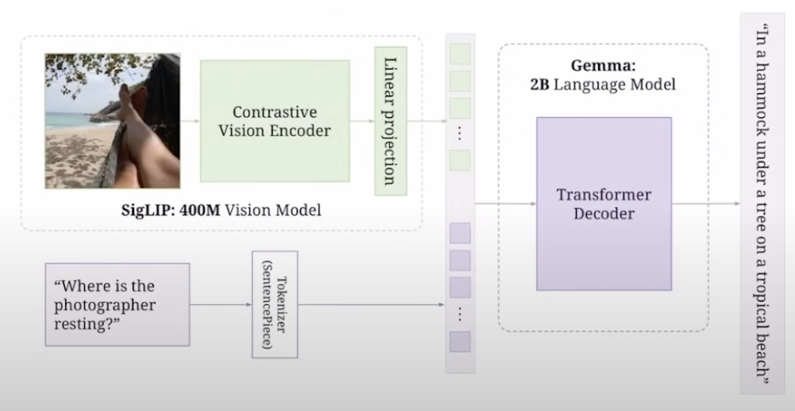
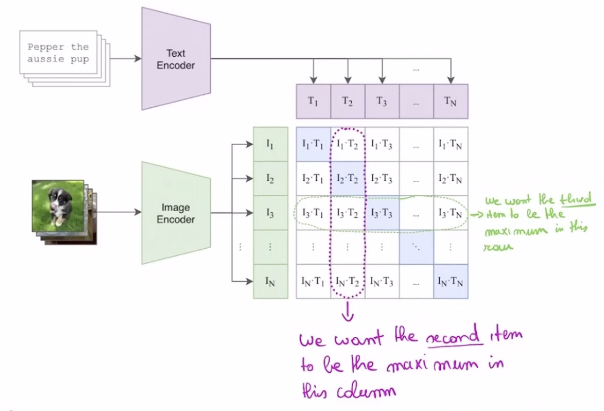

# Components

## Contrastive Vision Encoder

### What is contrastive learning?

Above is an example of **CLIP** (Contrastive-Language-Image Pre-training) architecture.

#### Text Encoder
The text encoder in CLIP typically uses a Transformer-based architecture (similar to GPT or BERT):
1. Input Processing
   - Text is first tokenized into sub-words
   - Example: "Pepper the aussie pup" → ["Pepper", "the", "aussie", "pup"]

2. Token Embeddings (e.g. T1, T2, T3 ... Tn)
   - Each token is converted into an embedding vector
   - Positional encodings are added to maintain sequence order

3. Transformer Processing
    ```
    [CLS] (special classification token that aggregates sequence info) + tokens → Transformer Layers →
    ↓
    Self-attention processes relationships between words
    ↓
    Feed-forward networks process token representations
    ↓
    Final text embedding
    ```

---

#### Image Encoder
The image encoder typically uses a Vision Transformer (ViT) or CNN architecture:
1. Image Preprocessing
    ```
    Original Image (in this case puppy photo) → Resize → Normalize
    ↓
    Split into patches (for ViT) or process through conv layers (for CNN)
    ```

2. For Vision Transformer (ViT)
    ```
    Image patches → Linear projection + position embeddings
    ↓
    Transformer encoder layers process patch relationships
    ↓
    [CLS] token captures global image representation
    ```

3. For CNN-based
    ```
    Image → Convolutional layers
    ↓
    Feature maps at different scales
    ↓
    Global pooling for final representation
    ```

PaliGemma is **ViT-based** rather than CNN-based.