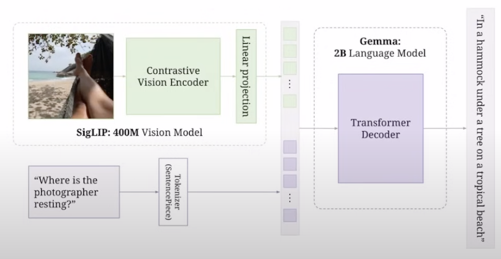

# Table of Contents
- [Table of Contents](#table-of-contents)
- [Components](#components)
  - [Contrastive Vision Encoder](#contrastive-vision-encoder)
    - [What is contrastive learning?](#what-is-contrastive-learning)
      - [Text Encoder](#text-encoder)
      - [Image Encoder](#image-encoder)
      - [Similarity Matrix](#similarity-matrix)
      - [Training with Loss Functions](#training-with-loss-functions)
      - [CLIP Training Implementation](#clip-training-implementation)
    - [What is the problem with CLIP?](#what-is-the-problem-with-clip)
      - [1. The Softmax Function](#1-the-softmax-function)
        - [In CLIP's Context](#in-clips-context)
        - [The Solution: Log-Space Calculations](#the-solution-log-space-calculations)
      - [2. Computational Challenges in CLIP](#2-computational-challenges-in-clip)
        - [Asymmetric Computation Requirements](#asymmetric-computation-requirements)
        - [Why This Is Expensive](#why-this-is-expensive)
        - [**Solution** to Computational Challenges: Sigmoid Loss](#solution-to-computational-challenges-sigmoid-loss)
          - [Why Replace Cross-Entropy Loss?](#why-replace-cross-entropy-loss)
          - [How Sigmoid Loss Works](#how-sigmoid-loss-works)
        - [SigLIP's Sigmoid-based Solution](#siglips-sigmoid-based-solution)
          - [How SigLIP Works](#how-siglip-works)
        - [Example of SigLIP Processing](#example-of-siglip-processing)
    - [Vision Transformer](#vision-transformer)

# Components



## Contrastive Vision Encoder

### What is contrastive learning?

Above is an example of **CLIP** (Contrastive-Language-Image Pre-training) architecture.

#### Text Encoder
The text encoder in CLIP typically uses a Transformer-based architecture (similar to GPT or BERT):
1. Input Processing
   - Text is first tokenized into sub-words
   - Example: "Pepper the aussie pup" → ["Pepper", "the", "aussie", "pup"]

2. Token Embeddings (e.g. T1, T2, T3 ... Tn)
   - Each token is converted into an embedding vector
   - Positional encodings are added to maintain sequence order

3. Transformer Processing
    ```
    [CLS] (special classification token that aggregates sequence info) + tokens → Transformer Layers →
    ↓
    Self-attention processes relationships between words
    ↓
    Feed-forward networks process token representations
    ↓
    Final text embedding
    ```

<br>

---

#### Image Encoder
The image encoder typically uses a Vision Transformer (ViT) or CNN architecture:
1. Image Preprocessing
    ```
    Original Image (in this case puppy photo) → Resize → Normalize
    ↓
    Split into patches (for ViT) or process through conv layers (for CNN)
    ```

2. For Vision Transformer (ViT)
    ```
    Image patches → Linear projection + position embeddings
    ↓
    Transformer encoder layers process patch relationships
    ↓
    Image embeddings (I₁, I₂, I₃, ..., Iₙ)
    ↓
    Paired with text embeddings to form similarity matrix
    ```

3. For CNN-based
    ```
    Image → Convolutional layers
    ↓
    Feature maps at different scales
    ↓
    Global pooling for final representation
    ```

PaliGemma is **ViT-based** rather than CNN-based.

<br>

---

#### Similarity Matrix
The grid in the center represents how well each image feature matches with each text feature. Essentially
the corresponding text embedding paired with the image embedding's dot product should have a high value (the blue squares). 
(e.g. I1 * T1)

A longer overview: 
1. Matrix Structure
   - Rows: Image features (I₁, I₂, I₃, ..., Iₙ)
   - Columns: Text features (T₁, T₂, T₃, ..., Tₙ)
   - Each cell (Iᵢ·Tⱼ): Similarity score between an image feature and text feature

2. How it Works
   - Higher scores (brighter cells) = stronger matches (e.g. I₁ * T₁)
   - Lower scores (lighter cells) = weaker matches (e.g. I₁ * T₂)
   - During training, the model learns to:
     - Maximize scores for matching image-text pairs
     - Minimize scores for non-matching pairs

3. Training Objective
   - The model wants matching pairs (like a dog photo with "aussie pup" text) to have high similarity
   - Non-matching pairs (like a dog photo with "red car" text) should have low similarity
   - This pushes the model to understand the relationship between visual and textual content

This contrastive approach helps the model learn meaningful connections between images and text without needing explicit labels for every concept.

<br>

---

**Problem:** How do we train the model to maximize similarity scores for matching image-text pairs (brighter cells) while minimizing scores for non-matching pairs (lighter cells)?

**Answer:** We use cross-entropy loss!

<br>

---

#### Training with Loss Functions

To train CLIP effectively, we use **cross-entropy loss**. To understand why this works well, let's first look at how language models are typically trained:

1. **Language Model Training Example**
   - Given a sentence: "I am very into ___"
   - Using Next Token Prediction Task
   - The model produces embeddings → converts to logits (raw scores before softmax)
   
   Example logits output might look like:
   ```python
   # Raw logit scores for possible next words
   logits = {
       "fashion": 5.2,   # Highest score
       "games": 3.1,
       "sports": 2.8,
       "coding": 1.9,
       "music": 1.7
       # ... (thousands more words with scores)
   }
   
   # After softmax conversion to probabilities distribution
   probabilities = {
       "fashion": 0.65,  # 65% confidence
       "games": 0.15,    # 15% confidence
       "sports": 0.12,   # 12% confidence
       "coding": 0.05,   # 5% confidence
       "music": 0.03     # 3% confidence
       # ... (all probabilities sum to 1)
   }
   ```
   
   - Logits are the raw scores before probability conversion
   - Cross-entropy loss helps by:
     - Converting these raw logits into probabilities using softmax
     - Pushing the probability of correct word ("fashion") towards 1
     - Pushing other probabilities towards 0

2. **Applying This to CLIP**
   - Instead of predicting next words like above, we're matching images and text instead
   - Each row/column in our similarity matrix needs one high value (matching pair dot products)
   - All other values should be low (non-matching pairs)

   Let's look at a small example with 3 images and 3 text pairs:

   **Step 1: Raw Similarity Scores**
   - When I₁ (dog photo) is compared with:
     - T₁ (text "aussie pup"): score 0.9 ✓
     - T₂ (text "red car"): score 0.3 ✗
     - T₃ (text "blue sky"): score 0.2 ✗

   - When I₂ (car photo) is compared with:
     - T₁ (text "aussie pup"): score 0.2 ✗
     - T₂ (text "red car"): score 0.8 ✓
     - T₃ (text "blue sky"): score 0.3 ✗

   - When I₃ (sky photo) is compared with:
     - T₁ (text "aussie pup"): score 0.1 ✗
     - T₂ (text "red car"): score 0.2 ✗
     - T₃ (text "blue sky"): score 0.95 ✓

   **Step 2: After Softmax (Image → Text Direction)**
   - For I₁ (dog photo):
     - T₁: 65% probability ✓ (want this to be 100%)
     - T₂: 20% probability ✗ (want this to be 0%)
     - T₃: 15% probability ✗ (want this to be 0%)

   **Step 3: After Softmax (Text → Image Direction)**
   - For T₁ (text "aussie pup"):
     - I₁: 70% probability ✓ (want this to be 100%)
     - I₂: 20% probability ✗ (want this to be 0%)
     - I₃: 10% probability ✗ (want this to be 0%)

   Cross-entropy loss then:
   - Makes correct pairs (marked with ✓) have higher probability
   - Makes incorrect pairs (marked with ✗) have lower probability
   - Does this in both directions (image→text and text→image)
   - Combines both directions for balanced training

The actual code implementation of this process is shown in the "CLIP Training Implementation" section below.

<br>

---

#### CLIP Training Implementation

Here's an example of how the contrastive learning is implemented based on the CLIP diagram above:

```python
# Based on official CLIP paper implementation
def clip_training(image_encoder, text_encoder, images, texts, temperature=0.07):
    # Step 1: Encode images and text through their respective encoders (purple and green sections in diagram)
    image_features = image_encoder(images)  # [batch_size, feature_dim] -> Creates I₁, I₂, I₃, ..., Iₙ
    text_features = text_encoder(texts)     # [batch_size, feature_dim] -> Creates T₁, T₂, T₃, ..., Tₙ
    
    # Step 2: Normalize features to unit length (helps with dot product similarity)
    # This ensures all similarity scores are between -1 and 1
    image_features = image_features / image_features.norm(dim=1, keepdim=True)
    text_features = text_features / text_features.norm(dim=1, keepdim=True)
    
    # Step 3: Create the similarity matrix shown in the center of the diagram
    # image_features @ text_features.t() computes all possible I·T dot products
    # This creates the grid where each cell is Iᵢ·Tⱼ
    logits = (image_features @ text_features.t()) / temperature
    
    # Step 4: Set up the ground truth - we want the diagonal to be highest
    # In the diagram, this means:
    # - The blue squares should have high values (matching pairs)
    # - All other squares should have low values
    labels = torch.arange(len(images))
    
    # Step 5: Compute bidirectional loss
    # For each row (image): want I₁·T₁ to be highest in row 1, I₂·T₂ in row 2, etc.
    image_loss = cross_entropy_loss(logits, labels)
    # For each column (text): want I₁·T₁ to be highest in column 1, I₂·T₂ in column 2, etc.
    text_loss = cross_entropy_loss(logits.t(), labels)
    
    # Step 6: Combine losses symmetrically
    # This ensures both modalities are trained equally
    loss = (image_loss + text_loss) / 2
    
    return loss

# The training process aims to:
# 1. Maximize values in the blue squares (like I₁·T₁, I₂·T₂, etc.)
#    - These are the matching pairs shown in the diagram
# 2. Minimize values everywhere else
#    - The non-blue squares represent incorrect pairings
# 
# Temperature controls contrast in similarity scores:
# - Control how "strict" the model is in its matching
# - Lower temperature (e.g., 0.07) = sharper contrast between matches/non-matches
# - Higher temperature = softer, more gradual distinctions
```

This implementation:
1. Processes batches of image-text pairs
2. Creates normalized embeddings in the same space
3. Computes similarity scores between all possible pairs
4. Uses cross-entropy loss to push matching pairs together
5. While pushing non-matching pairs apart in the embedding space

<br>

---

<br>

### What is the problem with CLIP?

Using cross-entropy loss is a problem with CLIP due to numerical stability issues with the softmax function. Let's break this down:

<br>

#### 1. The Softmax Function

The softmax function converts raw logits into a probability distribution. For input vector x:

$$ \text{softmax}(x_i) = \frac{e^{x_i}}{\sum_{j=1}^n e^{x_j}} $$

Where:
- $x_i$ is the current logit (similarity score)
- $e^x$ is the exponential function (e ≈ 2.71828)
- $\sum_{j=1}^n e^{x_j}$ is the sum of all exponentials in the sequence

<br>

**Problem: Exponential Growth**
- When x is large, exp(x) grows extremely fast
- For example:
  - exp(10) ≈ 22,026
  - exp(50) ≈ 5.18 × 10²¹
  - exp(100) ≈ 2.69 × 10⁴³
- A 32-bit float can only represent numbers up to ~3.4 × 10³⁸
- This means exp(89) is already too large to represent!

<br>

---

##### In CLIP's Context

When computing similarity scores:
1. Large dot products between embeddings can produce large numbers
2. These large numbers get exponentially larger through softmax
3. This can lead to:
   - Numerical overflow (numbers too large to represent)
   - Loss of precision
   - NaN (Not a Number) errors

<br>

---

##### The Solution: Log-Space Calculations

Looking at the similarity matrix in the image, we need to compute stable similarity scores between image features (I₁, I₂, I₃, ..., Iₙ) and text features (T₁, T₂, T₃, ..., Tₙ). To prevent numerical instability:

$$ \text{log\_softmax}(x_i) = x_i - \log(\sum_{j=1}^n e^{x_j}) $$

This first equation:
- Takes the original similarity score ($x_i$)
- Subtracts the log of the sum of exponentials
- Helps avoid overflow by working in log space

We can make this even more stable by rewriting it as:

$$ \text{log\_softmax}(x_i) = x_i - (\max(x) + \log(\sum_{j=1}^n e^{x_j - \max(x)})) $$

This improved version:
- First finds the maximum value in the sequence ($\max(x)$)
- Subtracts this maximum from each score before exponentiating
- Makes all values ≤ 0 before exp(), preventing overflow
- Adds back the maximum at the end to maintain correctness

For example, in our similarity matrix:
- If I₂·T₂ = 100 (maximum score in column T₂)
- Then we subtract 100 from all scores in that column
- Now exp(score - 100) will be small and manageable
- The relative relationships between scores are preserved

This stabilization is crucial because:
1. Each row in the matrix needs one high value (matching pair)
2. Each column needs one high value (matching pair)
3. All other values should be relatively small
4. We need to compute this stably for both image→text and text→image directions

<br>

#### 2. Computational Challenges in CLIP

Looking at the similarity matrix in the image, CLIP faces significant computational overhead due to its bidirectional nature:

##### Asymmetric Computation Requirements

Based on the SigLip paper, due to the asymmetry of the softmax loss, normalization is performed twice: across images and across texts:

1. **Row-wise Softmax (Image → Text)**
   - For each image embedding (I₁, I₂, ..., Iₙ):
     - Must compute softmax across all text embeddings
     - Example: For I₃ row, compute softmax over [I₃·T₁, I₃·T₂, I₃·T₃, ..., I₃·Tₙ]
   - Total: N softmax computations (one per row)

2. **Column-wise Softmax (Text → Image)**
   - For each text embedding (T₁, T₂, ..., Tₙ):
     - Must compute softmax across all image embeddings
     - Example: For T₂ column (purple dotted box), compute softmax over [I₁·T₂, I₂·T₂, I₃·T₂, ..., Iₙ·T₂]
   - Total: N softmax computations (one per column)

<br>

---

##### Why This Is Expensive

1. **Scaling Issues**
   - With batch size N, need 2N softmax computations
   - Each softmax requires:
     - N exponential operations
     - N additions for the denominator
     - N divisions for normalization

2. **Memory Requirements**
   - Must store full N×N similarity matrix
   - Keeps all intermediate values for gradient computation
   - Memory grows quadratically with batch size

3. **Computational Complexity**
   - Total operations: O(N²) for matrix creation
   - Plus O(N²) for bidirectional softmax
   - Makes large batch training challenging

<br>

---

##### **Solution** to Computational Challenges: Sigmoid Loss


One solution to CLIP's computational overhead is replacing cross-entropy loss with sigmoid loss:

###### Why Replace Cross-Entropy Loss?

1. **Problem with Cross-Entropy**
   - Requires softmax computation first
   - As we saw, needs both row-wise and column-wise softmax
   - Computationally expensive at O(N²)
   - Memory intensive for large batches

2. **Sigmoid Loss Alternative**
   - Operates on individual similarity scores
   - No need for softmax normalization
   - Can process each I·T pair independently
   - Reduces memory and computation requirements

###### How Sigmoid Loss Works

Instead of normalizing across rows and columns:
1. Each similarity score I·T is passed through sigmoid function:
   $$ \sigma(x) = \frac{1}{1 + e^{-x}} $$

2. Binary cross-entropy is applied to each score:
   - Matching pairs (diagonal) should output 1
   - Non-matching pairs should output 0

Benefits:
- Processes each element independently
- No need for expensive normalization
- Memory efficient: can process in smaller chunks
- Still maintains contrastive learning objective

Comparison of Complexity:
```
Cross-Entropy + Softmax:
- Must process entire N×N matrix at once
- O(N²) memory and computation

Sigmoid Loss:
- Can process elements independently
- O(1) per element
- Easily parallelizable
```

This approach trades off some model accuracy for significant computational efficiency, making it more practical for large-scale training. Below is a larger overview of how sigmoid loss works.

<br>

---

##### SigLIP's Sigmoid-based Solution

Looking at the similarity matrix in the image, SigLIP (Sigmoid Loss for Image-Text Pairs) proposes a more efficient approach:

###### How SigLIP Works

1. **Direct Similarity Processing**
   - For each cell in the similarity matrix (I·T pairs):
     - I₁·T₁, I₁·T₂, I₁·T₃, ... (first row)
     - I₂·T₁, I₂·T₂, I₂·T₃, ... (second row)
     - And so on...
   - Each similarity score is processed independently through sigmoid

2. **Binary Labels**
   - Matching pairs (blue squares in diagram):
     - I₁·T₁ should be 1
     - I₂·T₂ should be 1
     - I₃·T₃ should be 1
   - Non-matching pairs (all other cells):
     - Should be 0
     - Example: I₁·T₂, I₁·T₃, I₂·T₁, etc.

3. **Loss Computation**
   $$ L_{SigLIP} = -\frac{1}{N}\sum_{i=1}^N [\log(\sigma(s_{ii})) + \sum_{j\neq i}\log(1-\sigma(s_{ij}))] $$
   
   Where:
   - $s_{ij}$ is the similarity score between Iᵢ and Tⱼ
   - $\sigma$ is the sigmoid function
   - $s_{ii}$ represents matching pairs (diagonal)
   - $s_{ij}$ (i≠j) represents non-matching pairs

4. **Key Benefits**
   - No need for row/column normalization
   - Can process each cell independently
   - Easily parallelizable
   - Memory efficient: can process subsets of matrix

5. **Comparison to Original CLIP**
   - Original CLIP (looking at T₂ column in purple):
     - Needs entire column to compute softmax
     - Must normalize across all image pairs
   - SigLIP:
     - Can process I₁·T₂, I₂·T₂, I₃·T₂ independently
     - No need to wait for full column computation

This approach maintains the contrastive learning objective (matching correct image-text pairs) while being computationally more efficient and numerically stable.

<br>

---

##### Example of SigLIP Processing

Let's look at a small 3×3 example from our similarity matrix:

1. **Raw Similarity Scores**
   ```
   Similarity Matrix (s_ij):
   [Dog Image I₁]    [0.8  0.2  0.1]  → [T₁: "aussie pup"]
   [Car Image I₂]    [0.1  0.9  0.2]  → [T₂: "red car"]
   [Sky Image I₃]    [0.2  0.1  0.7]  → [T₃: "blue sky"]
   ```

2. **Apply Sigmoid to Each Score**
   $$ \sigma(x) = \frac{1}{1 + e^{-x}} $$
   
   ```
   After Sigmoid:
   [Dog Image I₁]    [0.69  0.45  0.42]  → [T₁: "aussie pup"]
   [Car Image I₂]    [0.42  0.71  0.45]  → [T₂: "red car"]
   [Sky Image I₃]    [0.45  0.42  0.67]  → [T₃: "blue sky"]
   ```

3. **Binary Label Classification**
   ```
   Target Matrix (1 for matches, 0 for non-matches):
   [Dog Image I₁]    [1  0  0]  → [T₁: "aussie pup"]
   [Car Image I₂]    [0  1  0]  → [T₂: "red car"]
   [Sky Image I₃]    [0  0  1]  → [T₃: "blue sky"]
   ```

4. **Loss Computation**
   For diagonal elements (matches):
   - I₁·T₁: -log(0.69)
   - I₂·T₂: -log(0.71)
   - I₃·T₃: -log(0.67)

   For off-diagonal elements (non-matches):
   - I₁·T₂: -log(1 - 0.45)
   - I₁·T₃: -log(1 - 0.42)
   etc.

   Final loss is the average of all these terms.

Key Advantages Shown in Example:
1. Each cell processed independently
2. No need to normalize rows or columns
3. Can compute loss for any subset of pairs
4. Numerically stable (all values between 0 and 1)

<br>

---

<br>

### Vision Transformer

Using the article "An Image is Worth 16x16 Words: Transformers for Image Recognition at Scale" (https://arxiv.org/abs/2010.11929), we will dive deep on how it works for the 
Contrastive Vision Encoder. The transformer model is a sequence-to-sequence model that is fed with a sequence of embeddings that outputs a sequence of contextualized embeddings. 


Looking at the diagram, we can see the process flows from bottom to top:
1. Start with an input IMAGE (4x4 grid shown in diagram)
2. Transform it into EMBEDDINGS OF PATCHES
3. Add positional encodings (POS. ENC.)
4. Process through TRANSFORMER
5. Output CONTEXTUALIZED EMBEDDINGS

Let's dive deeper into each step:

1. **Image Patching & Convolution**
   - Starting with the IMAGE in the diagram (4x4 grid at bottom)
   - The image is divided into non-overlapping patches
   - In the diagram, we see a 4x4 grid creating 16 patches (numbered 1-16)
   ```python
   # Example of patch extraction using convolution
   class PatchExtractor(nn.Module):
       def __init__(self, patch_size):
           super().__init__()
           self.conv = nn.Conv2d(
               in_channels=3,  # RGB image
               out_channels=768,  # Embedding dimension
               kernel_size=patch_size,
               stride=patch_size
           )
           
       def forward(self, x):  # x: (B, 3, H, W)
           # Convert image to patches using convolution
           patches = self.conv(x)  # (B, 768, H/patch_size, W/patch_size)
           # Reshape to sequence of patches
           patches = patches.flatten(2).transpose(1, 2)  # (B, N, 768)
           return patches
   ```

2. **Embedding Creation (EMBEDDINGS OF PATCHES in diagram)**
   - Each patch is processed through convolution + flatten operation
   - This flattens each 2D patch (e.g. 16x16 pixels with 3 RGB channels = 768 values) into a single row vector by concatenating all pixel values in sequence
   - Results in sequence of embeddings (shown as 1-16 in bottom row)
   ```python
   # Converting patches to embeddings
   patch_dim = patch_size * patch_size * 3  # 16x16x3 = 768 for 16x16 patches
   embedding_dim = 768
   patch_to_embedding = nn.Linear(patch_dim, embedding_dim)
   ```

3. **Position Encoding Addition (POS. ENC. in diagram)**
   - The diagram shows "POS. ENC." row with numbers 1-16
   - Position encodings are vectors that encode the spatial location of each patch
   - When added to patch embeddings, they help the transformer understand where each patch was located in the original image
   - Without position encodings, the transformer would lose all spatial information since patches are processed as a flat sequence
   - The addition is element-wise: each position encoding vector is added to its corresponding patch embedding vector
   ```python
   class PositionalEncoding(nn.Module):
       def __init__(self, d_model, max_patches):
           super().__init__()
           # Create learnable position embeddings
           self.pos_embedding = nn.Parameter(
               torch.randn(1, max_patches, d_model)
           )
           
       def forward(self, x):
           # x: patch embeddings (B, N, D)
           return x + self.pos_embedding  # Add positional information
   ```

4. **Transformer Processing**
   - The large "TRANSFORMER" box in diagram processes the sequence
   - Each patch embedding can interact with and incorporate information from all other patch embeddings through self-attention:
     - For example, if patch 1 shows part of a dog's ear and patch 8 shows part of the tail:
       - The self-attention mechanism allows patch 1 to look at patch 8 and all other patches
       - This helps patch 1's embedding understand it's part of a larger dog shape
       - Similarly, patch 8 can look back at patch 1 and other patches
     - This all-to-all interaction between patches is what the large "TRANSFORMER" box represents
   - Uses standard transformer encoder architecture with modifications:
   ```python
   class TransformerEncoder(nn.Module):
       def __init__(self, dim, depth, heads):
           super().__init__()
           self.layers = nn.ModuleList([])
           for _ in range(depth):
               self.layers.append(nn.ModuleList([
                   PreNorm(dim, SelfAttention(dim, heads)),
                   PreNorm(dim, FeedForward(dim))
               ]))
           
       def forward(self, x):
           # x: sequence of patch embeddings + positions
           for attn, ff in self.layers:
               # Self-attention allows patches to interact
               x = attn(x) + x  # Residual connection
               x = ff(x) + x    # MLP processing
           return x
   ```

5. **Final Contextualized Embeddings**
   - Output shown at top of diagram as "CONTEXTUALIZED EMBEDDINGS"
   - Each position (1-16) now contains information from other patches
   - The embeddings maintain spatial relationships but are enriched with context
   - These embeddings can be used for downstream tasks
   - Unlike language models that process tokens sequentially (word1 → word2 → word3),
     Vision Transformers process all patches simultaneously:
     ```
     Language Model (Sequential):
     "The" → "cat" → "sits" → "on" → "mat"
     (Each word depends on previous words)
     
     Vision Transformer (Parallel):
     Patch1 ↔ Patch2 ↔ Patch3 ↔ ... ↔ Patch16
     (All patches attend to each other simultaneously)
     ```
   - Example with a light source in an image:
     - Consider patches showing a lamp illuminating a room
     - In the diagram's 4x4 grid, if patch 6 contains a bright lamp:
       1. Initial patch embedding just sees local brightness
       2. Through transformer's self-attention (big "TRANSFORMER" box):
          - Patch 6 (lamp) influences all other patches
          - Surrounding patches (5,7,2,10) learn light falloff
          - Distant patches learn shadow patterns
       3. Final contextualized embeddings (top row) capture:
          - Local features (brightness, color)
          - Global context (lighting effects, shadows)
          - Spatial relationships (light direction, distance)
   - This parallel processing of all patches enables the model to:
     - Capture complex spatial relationships
     - Model long-range dependencies across the image
     - Learn global visual patterns

The diagram effectively shows the transformation from:
- 2D spatial image (bottom 4x4 grid)
- To 1D sequence of patch embeddings (EMBEDDINGS OF PATCHES)
- Enhanced with position information (POS. ENC.)
- Processed through transformer for context (TRANSFORMER)
- Resulting in final contextualized representation (top row)

This process allows the model to:
1. Break down spatial image data into processable sequences
2. Maintain spatial relationships through position encodings
3. Enable global reasoning through transformer's self-attention
4. Create rich, context-aware representations of image patches